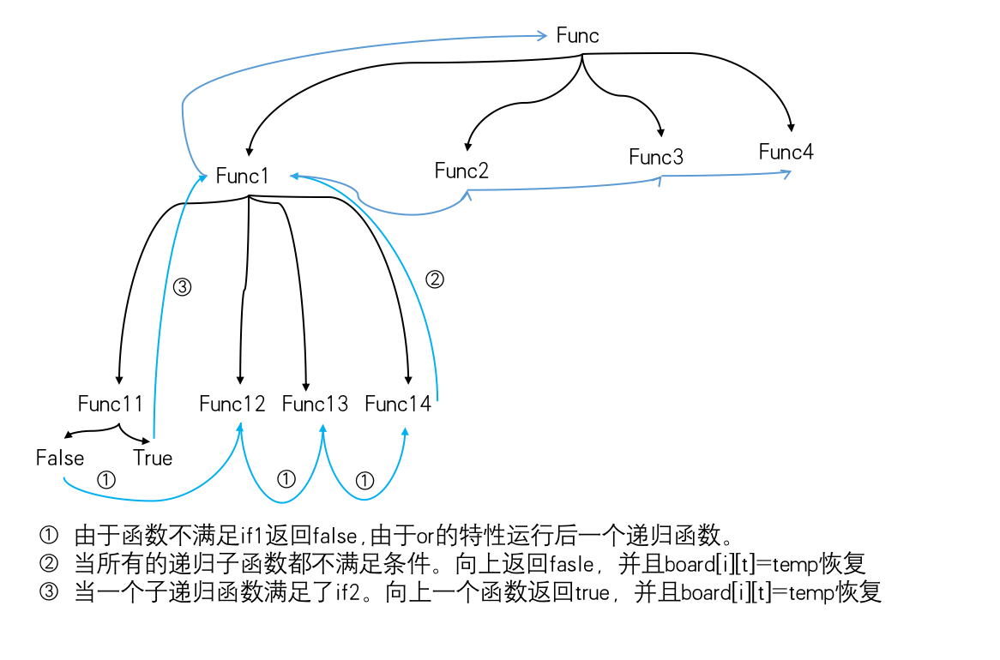

# 一.回溯算法
## 1.模版
在回溯算法是一种带有递归特性的算法，对于刚开始接触这种算法的同学来说很难理解这种算法的运行逻辑。从模版的角度先来熟悉一下一般的套路：
```python
    if ...首先判断是否符合条件
    for i in nums: ...循环枚举出所有的情况
        加入枚举变量
        递归
        剔除枚举变量
```

## 2.例题1 [全排列](https://leetcode-cn.com/problems/permutations/)
可重复的全排列，在这道题中，我们应该先完善递归核心部分。
leetcode类似题：
[字符串的排列](https://leetcode-cn.com/problems/zi-fu-chuan-de-pai-lie-lcof/)
[电话号码的字母组合](https://leetcode-cn.com/problems/letter-combinations-of-a-phone-number/)
[全排列 II](https://leetcode-cn.com/problems/permutations-ii/)
[字母大小写全排列](https://leetcode-cn.com/problems/letter-case-permutation/)
[括号生成](https://leetcode-cn.com/problems/generate-parentheses/)......

2.1 核心结构
- 首先先思考有哪些可能性
```python
for i in llist:
```
- 然后将枚举的结果加入到temp变量中
```python
    for i in llist: #进行枚举
        temp.append(i) #加入枚举变量
        sum(temp) #递归判断
        temp.pop() #剔除枚举变量
```
- 然后加入判断结构，将满足长度的条件的枚举结果记录到tmp
```python
    if len(temp)==len(llist):
        tmp.append(temp[:])
        return
```
在这里return起到了一个向上一层回调的作用。如果没有这个return，就会出现递归太深的错误，这是由于没有及时停止导致的。
```
RecursionError: maximum recursion depth exceeded while calling a Python object
```
- 这样我们就写出了核心结构

由于是一个递归的程序，我们自然的想到把这个结构作为一个单独的函数。

```python
    def sum(temp):
        if len(temp)==len(llist):
            tmp.append(temp[:])
            return
        for i in llist:
            temp.append(i)
            sum(temp)
            temp.pop()
```

2.2 完善所有结构

然后我们发现tmp这个变量应该是一个全局的变量，llist是一个输入变量，而temp这个变量可以直接用参数变量就可以了。
```python
def compute(llist):
    tmp=[]    #tmp用于记录符合条件的结果
    def summ(temp):#temp用于递归过程中进行记录枚举结果
        if len(temp)==len(llist):#判断
            tmp.append(temp[:])
            return
        for i in llist: #进行枚举
            temp.append(i) #加入枚举变量
            summ(temp) #递归判断
            temp.pop() #剔除枚举变量
    summ([])
    return tmp
print(compute([1,2,3]))

```
***附题1:我们在此基础上可以写一个不重复的全排列***
```python
def compute(llist):
    tmp=[]
    def sum(temp):
        if len(temp)==len(llist):
            tmp.append(temp[:])
            return
        for i in llist:
            if i in temp:#在此处添加拦截的判断就可以简单处理
                continue
            temp.append(i)
            sum(temp)
            temp.pop()
    sum([])
    return tmp
print(compute([1,2,3]))
#输出[[1, 2, 3], [1, 3, 2], [2, 1, 3], [2, 3, 1], [3, 1, 2], [3, 2, 1]]
```

***附题2:再进一步，如果llist中包含重复数字，上面这种方法就不行了，输出为空，我们又要怎么办呢？***

我们通过一个seen来去重就可以了。
```python
def compute(nums):
    tmp=[]
    def sum(st,temp):
        if len(temp)==len(nums):
            tmp.append(temp[:])
            return
        seen=set()
        for i in range(len(st)):
            if st[i] in seen:
                continue
            seen.add(st[i])
            temp.append(st[i])
            sum(st[:i]+st[i+1:],temp)
            temp.pop()
    sum(nums,[])
    return tmp
print(compute([1,2,3,4]))
```


***附题3:可能我们听过这样一个说法，所有的递归本质上都可以用循环来替代。那么这两者之间究竟有什么关系呢？我们将这道题改成非递归形式会怎么样？***

```python
#非递归的回溯算法

nums=[1,2,3]

def quan(nums):
    stack=[]
    for t in nums:
        stack.append(t)
    res=[]
    temp=[]
    while stack:
        node=stack.pop()
        temp.append(node)
        if node and len(temp)!=len(nums):
            for i in nums:
                stack.append(i)
        if len(temp)==len(nums):
            res.append(temp[:])
            temp.pop()
            if node==nums[0]: 
                tnode=temp.pop()
                while temp and tnode==nums[0]:
                    tnode=temp.pop()
    return res
print(quan(nums))
```
我们比较一下这份非递归代码和前面的递归代码，我们发现非递归代码采用了stack来代替了系统中栈的效果，所以我们需要自己维护一个栈。这样的话我们需自己判断什么时候去添加什么时候去pop。事实上我在考虑pop的时候还是花了不少时间才调试正确，递归写法确实考虑问题简单不少。同时，我们注意到我们把判断条件放在了循环中，而在递归程序中我们需要放在开始的位置，这是一个很大的区别。一般来讲我们总会想到在循环中做判断，而在程序开始做判断是一种反直觉的行为，所以说递归程序如果不多多练习是很容易写错的。在我们的算法训练时，要特别注意判断条件在两种写法中的区别，不然容易混着写导致解题错误。

## 2.例题2 [单词搜索](https://leetcode-cn.com/problems/word-search/)
全排列是一种最典型的回溯算法的案例。其关键就在于开始所谈到的模版结构，核心关键在于：判断方式，枚举所有情况，添加递归这三点。事实上在三个需要考虑的点上，枚举所有情况是比较简单的。难的是设计一种好的方式来判断条件以及添加递归。
下面是一种典型的思路，这种思路延续了上面的模版，但是却出现了一个难以解决的问题。

2.1 核心结构

- 首先想办法列举出所有的可能性，这里我们的可能性分成两部分，一部分是起始点的可能性，另一部分是上下左右下一步向哪里走的可能性。
```python
    for i in range(len(board)):
        for t in range(len(board[i])):# 我们通过一个双循环的结构就可以将第一种可能性走完
```
2.2 用or来递归

对于第二种可能性，我这里介绍一种新的结构。这种结构通过or关键字，混合了枚举和添加递归这两件事情。为什么我们需要关键字而不是通过4个单独的函数调用来实现同样的功能？事实上这两种方式各有千秋，由于or自带的判断属性，如果采用or的话，在return的问题问题上我们必须格外注意。如果题目中对于我们的要求仅仅是判断是或者否，or将起到很大的作用。
```python
    def compute(i,t,temp,count):
      flag=compute(i+1,t,count+1) or compute(i,t+1,count+1) or compute(i-1,t,count+1) or compute(i,t-1,count+1)#count在其中起到一个计数的作用
        return flag
```
接下来就是进行判断方式的设计，由于我们采用了or这种结构，对于我们的设计就有了额外的限制了。
```python
    def compute(i,t,temp,count):
        if i>=w or t>=h or board[i][t]!=word[count]:
            return False#我们判断，i,t超出范围，或者word值不对返回False
        flag=compute(i+1,t,count+1) or compute(i,t+1,count+1) or compute(i-1,t,count+1) or compute(i,t-1,count+1)
        return flag
```
然后我们也必须返回True的情况，在True的情况下，我们递归向上返回True。由于or的特性，只要前面的函数True后面的函数就不会执行，等于做了一个剪枝的操作。
```python
    def compute(i,t,count):
        if i>=w or t>=h or board[i][t]!=word[count]:
            # print("no: "+board[i][t])
            return False
        if count==len(word)-1:
            return True
        flag=compute(i+1,t,count+1) or compute(i,t+1,count+1) or compute(i-1,t,count+1) or compute(i,t-1,count+1)
        return flag
```
2.3 复盘整理
此时我们已经完成了大部分的工作，整体思路和全排列是一样的。我们来复盘一下思路：
1. 列举出所有的情况：通过一个双重for循环列举出了所有的起始点，通过四个递归函数列举出了上下左右四种情况。
2. 设计添加和撤销操作:我们通过对整数进行+1操作，在递归中自然帮助我们进行了这个操作。与此相对比的是，全排列中list的操作需要我们手动的append和pop。
3. 设计判断条件：这题由于采用了or结构，我们借助了or的特性进行了剪枝。与全排列对比来看，全排列是采用全局list添加符合条件的值，所以直接返回return。而利用or的话，我们需要同时设计false和true的情况。

2.4 完善结构
最后我们发现有一个小问题，我们还没有处理。那就是事实上我们不能走回头路，所以我们需要对遍历过的路径进行标记。由于board是一个list,我们采用标记法来进行修改。
```python
        board[i][t],temp='/',board[i][t]
        flag=compute(i+1,t,count+1) or compute(i,t+1,count+1) or compute(i-1,t,count+1) or compute(i,t-1,count+1)
        board[i][t]=temp
```
至此，我们完成了所有的代码，完整代码如下：
```python
board = [["A","B","C","E"],["S","F","C","S"],["A","D","E","E"]]
word = "ABCCEC"
def solution(board,word):
    w=len(board)
    h=len(board[0])
    def compute(i,t,count):
        if i<0 or i>=w or t<0 or t>=h or board[i][t]!=word[count]:
            # print("no: "+board[i][t])
            return False
        if count==len(word)-1:
            return True
        board[i][t],temp='/',board[i][t]
        flag=compute(i+1,t,count+1) or compute(i,t+1,count+1) or compute(i-1,t,count+1) or compute(i,t-1,count+1)
        board[i][t]=temp
        return flag
    for i in range(len(board)):
        for t in range(len(board[i])):
            if compute(i,t,0):
                return True
                # print(board[i][t])
    return False
print(solution(board,word))
```
2.5 分析代码运行顺序
有个有趣的问题，在全排列问题中我们返回return，执行递归后的代码是很容易理解的。而在单词搜索问题中，递归之后不仅有list恢复，还有return,那么这两个代码什么时候运行呢？
```python
        board[i][t]=temp
        return flag
```

```python
    def compute(i,t,count):
    #判断部分，在函数进来的时候第一时间运行
        if i<0 or i>=w or t<0 or t>=h or board[i][t]!=word[count]:
            return False
        if count==len(word)-1:
            return True


        # 顺序执行部分，只要没有被第一个IF拦截就会执行
        board[i][t],temp='/',board[i][t]

        #递归部分，第一个IF返回就会执行在一个递归。第二个if返回会执行，由于or的作用，直接导致后面的递归部分不再执行。
        flag=compute(i+1,t,count+1) or compute(i,t+1,count+1) or compute(i-1,t,count+1) or compute(i,t-1,count+1)

        #那么处于递归后面的部分什么时候执行呢？
        board[i][t]=temp
        return flag
```
事实上，这个两行代码将在四个递归函数全部为False的时候再去执行。看下图我们来清晰的整理整个流程。



## 例题3 [分割回文串](https://leetcode-cn.com/problems/palindrome-partitioning/)

这道题上来感觉有点难，由于不确定到底分成几部分，所以在没法枚举，第一步就遇上了困难。再就是隐隐发现有动态规划的影子，因为前面的分割如果不是回文的话，后面其实不用判断，如果前面部分证明是回文，那么总体有多少情况依赖于前面分割情况可能数。（合作）

```python
class Solution:
    def partition(self, s):
        def recall(s, tmp):
            if not s:
                res.append(tmp[:])
                return
            for i in range(1, len(s)+1):
                if s[:i] == s[:i][::-1]:#反转字符串
                    tmp.append(s[:i])
                    recall(s[i:], tmp)
                    tmp.pop()
        res = []
        recall(s, [])
        return res
ss=Solution()
print(ss.partition("aaba"))
```
还是采用回溯的套路来解一下。
- 首先有一个反转字符串判断的技巧，if s[:i] == s[:i][::-1]:#反转字符串。这里就体现出python刷题的优越性了。
- 就像开头所说，这题上来第一个问题是怎么分割需要好好理清楚。事实上，字符串分割通常方法就是，以步长作为循环方式。
- 再一个问题，递归判断的时候什么作为结束方式呢？我们发现这题有两个判断条件，一个是递归回溯的位置的判断，一个是回文串的判断。这点相当关键，如果把两个判断理解成了只有一个回文串判断思路就乱了。为了理清思路，有必要画个回溯图。
从下图可以看出，同样是回溯，其实由于第一步遍历条件，第二步判断回溯点的设置有区别，整体结构呈现是很不一样的。而这道题显然比之前的题都要复杂。这个复杂性往往体现在其在回溯过程中的回溯步骤的多少，一般回溯循环越多越难清晰思考。由于我们人类的思考的局限性，我们擅长与顺序思考，想象，而递归这种需要存储思考的问题（需要用栈来思考的问题），我们很难清晰想象。这就需要我们多多发展理论，多多训练思维能力了。

  

- 这题很有研究价值，尝试改写成顺序结构（合作）

## 3.所有题进行整合
[黄金矿工](https://leetcode-cn.com/problems/path-with-maximum-gold/)

这道题和单词搜索具有很高的相似度，仅仅在判断条件上存在一点区别。

```python
##这个是一开始写出的错误代码，具有重要的参考意义
class Solution:
    def getMaximumGold(self, grid):
        m=len(grid)#行
        n=len(grid[0])#列
        # allsum=0 我们缺少好的办法解决在递归中，变量恢复的问题。我们可以采用全局静态变量，问题是这种变量又不能在我们后续调用中起到归0的作用
        maxsum=0
        def compute(i,t,allsum):
            if i>=m or t>=n or grid[i][t]==0:
                return 0
            if allsum+grid[i][t]>maxsum:
                maxsum=allsum+grid[i][t]
            temp,grid[i][t]=grid[i][t],0
            compute(i+1,t,allsum)
            compute(i,t+1,allsum)
            compute(i-1,t,allsum)
            compute(i,t-1,allsum)
            grid[i][t]=temp
            return allsum
            
        for i in range(m):
            for t in range(n):
                maxsum=max(maxsum,compute(i,t,0))
        return maxsum
ss=Solution()
grid=[[0,6,0],[5,8,7],[0,9,0]]
print(ss.getMaximumGold(grid))
```
我们来整理一下思路：
1.枚举所有的情况：与例2相同双for循环找起点。递归进行上下左右控制。
2.设计添加和撤销操作：我们将走过的路设置为0，并在最后恢复，这点也跟例2相同
3.判断条件：
这个出现了很大的问题，我们发现例2我们仅仅需要返回boolen值，所以我们采用了or结构。而在这个题中我们发现，我们需要保存每次尝试的值与最大值进行对比。而我们这个写法中maxsum这个值不能在内部函数compute中被调用,报错未定义：

```
NameError: name 'maxsum' is not defined
```

此时我们有三种探索的思路：第一种是采用nonlocal,global这两个关键词转化为全局变量；第二种思路是结合例1我们发现list的appned具有保持值的特性，我们是否可以用list代替单一变量。第三种思路，从语法层面再理解全局变量和内部函数的区别，找到真正意义上的全局变量。【合作】
接下来针对这三种思路进行探索：

- 采用nonlocal,global
```python
class Solution:
    def getMaximumGold(self, grid):
        def dfs(grid,x,y,res):
            nonlocal allgrid
            if not 0<=x<len(grid) or not 0<=y<len(grid[0]) or grid[x][y]==0:return False
            res.append(grid[x][y])
            grid[x][y],temp=0,grid[x][y]
            allgrid=max(allgrid,sum(res))
            dfs(grid,x+1,y,res) or dfs(grid,x-1,y,res) or dfs(grid,x,y-1,res) or dfs(grid,x,y+1,res)
            grid[x][y]=temp
            res.pop()
        allgrid=0
        for i in range(len(grid)):
            for t in range(len(grid[0])):
                dfs(grid,i,t,[])
        return allgrid
ss=Solution()
print(ss.getMaximumGold([[0,6,0],[5,8,7],[0,9,0]]))
```

nonlocal:nonlocal关键字修饰变量后标识该变量是上一级函数中的局部变量，如果上一级函数中不存在该局部变量，nonlocal位置会发生错误。nonlocal关键字只能用于嵌套函数中，并且外层函数中定义了相应的局部变量，否则会发生错误
global:global关键字修饰变量后标识该变量是全局变量，对该变量进行修改就是修改全局变量。global关键字可以用在任何地方，包括最上层函数中和嵌套函数中，即使之前未定义该变量，global修饰后也可以直接使用。（目前还没有摸清楚global的合适用法）

[1688. 比赛中的配对次数](https://leetcode-cn.com/problems/count-of-matches-in-tournament/)

这道题很有意思，枚举几种情况就可以发现n-1直接就是结果。但也很有启发，启发点就在于如何利用回溯模版来解答这道题。同时由于这是一道简单题，leetcode上main的答案可以说大部分都是有问题的，他们的答案是对的，可实际上过程都是蒙对的（由于本题n-1就能对，很多人的答案都是一通骚操作，其实蒙了一个n-1）。可见很多人学习算法真的是在找“感觉”做题，完全没有章法，蒙对的题还以为是真的自己厉害。

根据我所总结出的模版，第一步我们要列举出所有的可能性，结果我们发现这题的可能性完全不像之前所做的题那么显而易见。我们思考只要n为2的时候再进行一场比赛就可以决出冠军。所以我们对n大于2进行处理。我们很容易思考到：
```python
while n>2:
```
所以我们考虑遍历所有n的可能性就可以了。而这种可能性显然可以与第二步设计递归操作相结合。
```python
    while n>1:
        if n%2==0:
            summ=summ+n//2
        else:
            summ=summ+(n-1)//2
```
接下来我们思考判断条件。我们可以发现，当n为2的时候，可以返回1，然后进行回溯相加。最后我们得出代码：
```python
summ=0
def compute(n):
    global summ
    if n==2:
        summ=summ+1
        return
    while n>2:
        if n%2==0:
            summ=summ+n//2
            compute(n//2)
        else:
            summ=summ+(n-1)//2
            compute((n-1)//2+1)
    return summ
print(compute(7))
```
我们发现这个答案并不正确。出了什么问题呢？请画出树状图研究一下吧，这个问题其实涉及到了回溯设计十分核心的问题，我们必须对代码的运行顺序有一个非常清晰的认识才行。下面是正确答案：
```python
summ=0
def compute(n):
    global summ
    if n==2:
        summ=summ+1
        return
    if n>2:#这个点非常关键
        if n%2==0:
            summ=summ+n//2
            compute(n//2)
        else:
            summ=summ+(n-1)//2
            compute((n-1)//2+1)
    return summ
print(compute(7))
```
答案就是把 while 改成 if 。while这个操作会让我们没法控制return的值在我们的循环中。下面是我画的图：


我们与例二的流程比较一下我们可以发现，同样是回溯，同样的模版。但是实际的流程是不同的，我想问问这种流程难道是固定的几种吗？这个问题值得探究探究。如果流程是固定的几种，那么意味着我们只需要熟悉所有的流程，我们做题将会像呼吸那么自然。如果并非如此的话，那就更加有趣了，这一切是如何发生的呢？【合作】

[1415. 长度为 n 的开心字符串中字典序第 k 小的字符串](https://leetcode-cn.com/problems/the-k-th-lexicographical-string-of-all-happy-strings-of-length-n/)

```python
class Solution:
    def getHappyString(self, n,k) -> str:
        maxtmp=0
        ss=["a","b","c"]
        res=""
        def compute(tmp):
            nonlocal maxtmp
            nonlocal res
            if len(tmp)>1 and tmp[-1] ==tmp[-2]:
                return
            if len(tmp)==n:
                maxtmp+=1
                if maxtmp==k:
                    res+=tmp
                return

            for i in ss:
                tmp=tmp+i
                compute(tmp)
                tmp=tmp[:-1]
        compute("")
        return res

ss=Solution()
print(ss.getHappyString(1,4))

```
- 这道题上来愣了一下，第一步找到所有可能性，我一开始一直考虑要用双循环枚举，后来发现始终枚举不正确。这个问题就是犯了混用循环结构和递归结构的错误，属于对递归的循环性质理解不够，将这道题重新用循环结构重写（训练）。
- 再一个问题是这个写法少了一次剪枝操作，事实上在找到第k个之后就可以退出程序了，我一时没找到怎么直接退出的办法，这个属于递归结构运行顺序没有理清楚，通过画出递归运行结构解决（训练）。
- 这道题用到了两个全局变量，maxtmp，res。maxtmp用来记录数据，属于基操。res用来记录最后的结果属于偷懒，由于和上面一样的问题没有理清运行顺序，所以也就无法理出如何直接return出结果。（训练）
- 从题目分析上来看，这道题可能有不用回溯，枚举分析找规律的方法更快的得到结果。但我尝试了一下始终没找到规律在哪里。（合作）


[842. 将数组拆分成斐波那契序列](https://leetcode-cn.com/problems/split-array-into-fibonacci-sequence/)

这又是一道分割的题目，从例3我们明白了一个问题，所有这种不定长分割的问题都是通过在回溯的过程中进行组合达成目的的。所以遍历条件就是步长。那么同上一题，判断条件也有两个，一个是回溯的判断一个是进入递归的条件判断。既然用回溯的方式来组合，那么其中一个判断条件就确立了，依然是判断null。关键是第二个判断条件。第二个判断条件帮助我们决定返回的值，这题与上一题的不同点在于，上一题的判断条件中仅仅需要保证每一个枚举值为回文就可以，而这题是需要对整体进行判断，保证整体符合斐波那契数列的规律。所以我们要在递归函数下面设置两个if。

```python
class Solution:
    def splitIntoFibonacci(self, S):
        res=[]
        #判断是不是斐波那契数列
        def fb(llist):
            if len(llist)<3:
                return False
            for i in range(len(llist)-1):
                if i+2<len(llist) and int(llist[i])+int(llist[i+1])!=int(llist[i+2]):
                    return False
            return True

        def compute(S,tmp):
            if not fb(tmp) and len(tmp)>2:
                return
            elif fb(tmp) and len(S)==0:
                temp=[]
                for i in tmp:
                    temp.append(int(i))
                res.append(temp)
                return 
            for l in range(1,len(S)+1):#这个+1操作很关键，如果不  +1，只有一个数的字符串“1”无法被添加到tmp里面
                tmp.append(S[:l])
                compute(S[l:],tmp)
                tmp.pop()
        compute(S,[])
        return res[0]
ss=Solution()
S="1101111"
print(ss.splitIntoFibonacci(S))
```
整体逻辑其实和上一题是差不多的。

[200. 岛屿数量](https://leetcode-cn.com/problems/number-of-islands/)[Li]
回溯算法，并合集看过了也可以用来解一下
```python
class Solution:
    def numIslands(self, grid: List[List[str]]) -> int:
        res = 0
        m = len(grid)
        n = len(grid[0])
        def search(i,j,grid):
            if i<0 or i>=m or j<0 or j>=n or grid[i][j]=='#' or grid[i][j]=='0':
                return False
            #被搜索的置为"#"    
            grid[i][j]='#'
            flag = search(i-1,j,grid) or search(i+1,j,grid) or search(i,j-1,grid) or search(i,j+1,grid)
        
        for i in range(m):
            for j in range(n):
                if grid[i][j]=="1":
                    res+=1
                    search(i,j,grid)
        return res
```
