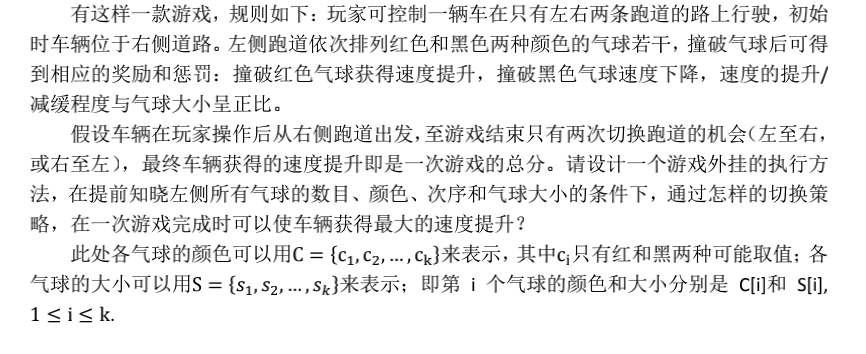

# 二.动态规划
如果说回溯算法的模版套路还有迹可循，动态规划则要灵活的多。但近年来随着内卷程度的不断加深，动态规划越来越多的出现在了面试过程中。动态规划最显然的特征是，后面要求的值依赖于前面的值。核心是定义状态，和找到状态之间的转换方式。

## [例1:最长递增子序列](https://leetcode-cn.com/problems/longest-increasing-subsequence/)
抛开超时这个问题，其实这题也可以用回溯法来做，尝试一下？
最典型的dp莫过于最长上升子序列。
```python
def longstr(nums):
    dp=[1 for i in range(len(nums))]
    for t in range(len(nums)):
        for z in range(t):
            if nums[t]>nums[z]:
                dp[t]=max(dp[t],dp[z]+1)
    return max(dp)

print(longstr([10,9,25,37,101,18]))
```
```python 
#回溯解（超时）
def longstr(nums):
    seen=[]
    maxx=0
    def compute(llist):
        nonlocal maxx
        if len(llist)>1 and llist[-1]<llist[-2]:
            return
        maxx=max(maxx,len(llist))
        for i in range(len(nums)):
            if i in seen:
                continue
            seen.append(i)
            llist.append(nums[i])
            compute(llist)
            llist.pop()
        return maxx
    return compute([])
print(longstr([10,9,25,37,101,18]))
```
回溯和动态规划是一种什么样的关系？任何一种算法从本质上来讲就是枚举和选择，所以理论上任何算法都可以通过暴力枚举出来。动规之所以快在于消除了重叠子问题。所以，反过来说，任何一种算法只要含有重叠子问题,即可以通过局部最值推导出全局最值，就可以使用动规来优化。
相似题：[53. 最大子序和](https://leetcode-cn.com/problems/maximum-subarray/)
```python
class Solution:
    def maxSubArray(self, nums: List[int]) -> int:
        if len(nums)==1:return nums[0]
        if len(nums)==0:return []
        dp=[-float("inf") for i in range(len(nums)+1)]
        for i in range(1,len(nums)+1):
            dp[i]=max(nums[i-1],dp[i-1]+nums[i-1])
        return max(dp)
```
有一种错误观点：最值问题才用动态规划

[动态规划只需要求我们评估最优解是多少，最优解对应的具体解是什么并不要求。因此很适合应用于评估一个方案的效果](https://leetcode-cn.com/problems/permutations/solution/quan-pai-lie-hui-su-suan-fa-by-cherry-n1/)

## [例2 最长回文子序列](https://leetcode-cn.com/problems/longest-palindromic-subsequence/)
与上一题不一样，这题是二维动规。同时，我们将根据这题来学习状态压缩的方法。关于这题的具体分析可以参看：
[这题的题解](https://leetcode-cn.com/problems/longest-palindromic-subsequence/solution/516-zui-chang-hui-wen-zi-xu-lie-by-ming-zhi-shan-y/)
```python
def longeststr(ss):
    ls=len(ss)
    dp=[[0 for i in range(ls)] for t in range(ls)]
    for z in range(ls):
        dp[z][z]=1
    for i in range(ls-1,-1,-1):
        for j in range(i+1,ls):
            if ss[i]==ss[j]:
                dp[i][j]= dp[i+1][j-1]+2
            else:
                dp[i][j]=max(dp[i+1][j],dp[i][j-1])
    return dp[0][ls-1]

print(longeststr("bbbab"))
```

下面主要来研究一下本体的状态压缩优化：
```python
    def longeststr(ss):
        ls=len(ss)
        dp=[1 for i in range(ls)]
        for i in range(ls-2,-1,-1):
            pre=0
            for j in range(i+1,ls):
                temp=dp[j]
                if ss[i]==ss[j]:
                    dp[j]=pre+2
                else:
                    dp[j]=max(dp[j],dp[j-1])
                pre=temp
        return dp[ls-1]
    print(longeststr("bbbab"))
```
下面是李达的回溯解法：
```python
class Solution:
    def longestPalindromeSubseq(self, s: str) -> int:
        res = []
        def func(st,temp):
            if temp ==temp[::-1]:
                res.append(len(temp))
            if len(temp)==len(s):
                return
            for i in range(len(st)):
                temp.append(st[i])
                func(st[i+1:],temp)
                temp.pop()
        func(s,[])
        return max(res)
```

## 题整合

[俄罗斯套娃信封问题](https://leetcode-cn.com/problems/russian-doll-envelopes/)

最先想到的解法，先把第一列排序一下，然后后一列最长子序列解一下。这个解法超时了，需要优化
```python
class Solution:
    def maxEnvelopes(self, envelopes: List[List[int]]) -> int:
        if not envelopes:
            return 0
        envelopes.sort(key=lambda x: (x[0], -x[1]))
        dp=[1 for i in range(len(envelopes))]

        for t in range(len(envelopes)):
            for z in range(t):
                if envelopes[t][1]>envelopes[z][1] and envelopes[t][0]>envelopes[z][0]:
                    dp[t]=max(dp[z]+1,dp[t])
        return max(dp)
```

全排列-动态规划解法
```python
class Solution:
    def permute(self, nums):
        if not nums:
            return None
        dp = [[] for i in range(len(nums))]
        dp[0] = [[nums[0]]]
        for i in range(1, len(nums)):
            for ans in dp[i-1]:
                dp[i].append(ans+[nums[i]])
                for j in range(len(ans)):
                    dp[i].append(ans[:j]+[nums[i]]+ans[j+1:]+[ans[j]])
        return dp[-1]

ss=Solution()
print(ss.permute([1,2,3,4]))
```
最大子数组

这题是中科院博士笔试的最后一题，典型的动态规划。相当于求一个包含正负数数组的最大子数组。跟最长子上升子序列很像。



核心代码就这样：
```python
def longzistr(nums):
    dp=nums.copy()
    for t in range(len(nums)):
        dp[t]=max(nums[t],nums[t]+dp[t-1])
    return max(dp)
nums=[-10,10,-5,2,3,100,-50]
print(longzistr(nums))

```
修改以符合题意：
```python
C=[10,10,5,2,3]
S=[-1,1,-1,1,1]
def compute(C,S):
    nums = list(map(lambda x,y:x*y,C,S))
    dp=nums.copy()
    for t in range(len(nums)):
        dp[t]=max(nums[t],nums[t]+dp[t-1])
    return max(dp)
print(compute(C,S))
```
进一步，我们发现dp[i]的值只和dp[i-1]相关。也就是说：
[-10,10,-5,2,3]
这个数组的dp从上一种做法的dp为:
[-10,10,5,12,15]
还可以看作:
[-10,10,15,12,15]
```python
C=[10,10,5,2,3]
S=[-1,1,-1,1,1]
def compute(C,S):
    nums = list(map(lambda x,y:x*y,C,S))
    dp0=nums[0]
    temp=0
    res=0
    for t in range(1,len(nums)):
        temp=max(nums[t],nums[t]+dp0)
        dp0=temp
        res=max(res,temp)
    return res
print(compute(C,S))
```

### 2021.1.13 

叶丽丽：[474. 一和零](https://leetcode-cn.com/problems/ones-and-zeroes/)
[题解](https://www.cnblogs.com/-LilyBlog-/p/14287153.html)
```python
def findMaxForm(strs, m, n):
    dp = [[[0] * (n + 1) for _ in range(m + 1)] for _ in range(len(strs) + 1)]
    for i in range(1, len(strs) + 1):
        ones = strs[i - 1].count("1")
        zeros = strs[i - 1].count("0")
        for j in range(m + 1):
            for k in range(n + 1):
                if j >= zeros and k >= ones and dp[i][j][k]<dp[i - 1][j - zeros][k - ones] + 1:
                    dp[i][j][k] = dp[i - 1][j - zeros][k - ones] + 1
                else:
                    dp[i][j][k] = dp[i - 1][j][k]
    return dp[-1][-1][-1]
print(findMaxForm(["10", "0001", "111001", "1", "0"],5,3))
```

李达: [指 Offer 63. 股票的最大利润](https://leetcode-cn.com/problems/gu-piao-de-zui-da-li-run-lcof/)

```python
class Solution:
    def maxProfit(self, prices: List[int]) -> int:
        prices = [prices[i]-prices[i-1] for i in range(1,len(prices))]
        dp = 0
        res = 0
        for i in range(len(prices)):
            dp = max(dp+prices[i],0)
            if dp>res:
                res = dp
        return res
```


### 2021.1.14
刘泽豪：0-1背包

题目描述：有n个物品，它们有各自的体积和价值，现有给定容量的背包，如何让背包里装入的物品具有最大的价值总和？
输入参数：N和W分别是背包能装物体的数量和背包能装的重量。wt数组指的是物体的重量，val指的是对应的价值。

```python
def onezerobag(N,W,wt,val):
    dp=[[0 for i in range(W+1)] for i in range(N+1)]
    for i in range(1,N+1):
        for w in range(1,W+1):
            if w-wt[i-1]<0:
                dp[i][w]=dp[i-1][w]
            else:
                dp[i][w]=max(dp[i-1][w-wt[i-1]]+val[i-1],dp[i-1][w])
    return dp[N][W]
print(onezerobag(3,4,[2,1,3],[4,2,3]))
```
动规的第一步是建立一种状态并且遍历状态，这种想法有点类似于回溯模版的第一步，相当于遍历所有的可能性。但难点在于怎么确定状态所表示的意义。我理解这种状态应该具有一种“归一”性质，即当下的状态可以推导出下一状态，换句话说，当下的状态具有归纳之前状态的特性。
就本题而言，我们建立一个二维数组dp[i][w],状态的含义是到i这个数量为止当前容量下的最大价值。比如说dp[3][5]=6的意思就是在选择前3个物体容量控制在5的时候，最大价值是6。
第一步的难点在于如何定义dp的含义，目前有一种可能猜想是具有一个限制条件就二维,第一个for是个数的循环，第二个是限制条件的循环。如果两个限制条件就变成了三维，for循环依然第一层个数，第二第三层分别是限制条件。
第二步是遍历所有的可能性。
第三步是寻找状态转移。这个转移方程往往采用max这种形式。相当于回溯中的判断和递归函数的操作。第三步的难点在于找到对应的状态转移关系。
        
叶丽丽：[416. 分割等和子集](https://leetcode-cn.com/problems/partition-equal-subset-sum/)

(本题题解写错了，待修改)本题首先除以2判断奇偶，如果奇数肯定不行。偶数的情况下，我们可以把题目理解成：是否存在一种情况，将几个数相加正好等于数组和sum/2（下文也称为target），并且剩下的数正好也等于sum/2。从回溯的角度上看，这个问题很好做。如果从动规的角度，
我们就得先定义dp数组的维度：本题很类似于01背包，限制条件只有一个就是达到sum/2。所以限制条件作为循环，再加上选择与否又是一个循环。因此可以判断是一个二维数组。
然后：我们定义dp的意义，在判断是二维数组的时候我们已经发现我们将通过添加数字与否作为第一个循环，所以dp[i][t]中，i的含义就是循环的数组下标，而t的含义就是sum/2的遍历值。
第二步：然后我们思考一些初始化值，当数量选择为0个的时候不可能达到target，所以设置为F。


而当target为0的时候，根据前文的定义，无论数量为多少都可以达到target，我们循环所有dp的位置，以遍历所有的可能性。此时，我们先把所有的dp设置为False。而taget为0的时候，无论多少数量都超过了taget，所以我们设置为T(这里有点难以理解？)


第三步：我们将建立状态转移的方式，也就是如何通过前面算出的值推算出后面的值。
首先我们考虑的第一点一定是数量上的关系，当一个数放进来的时候


```python
def fun(strs):
    n=sum(strs)
    if(n%2!=0):
        return False
    else:
        n//=2
    dp=[[False for _ in range(n+1)] for j in range(len(strs)+1)]
    for i in range(len(strs)+1):
        dp[i][0] = True
    for i in range(1,len(strs)+1):
        for j in range(1,n+1):
            if(j-strs[i-1]<0):
                dp[i][j]=dp[i-1][j]
            else:
                dp[i][j]=dp[i-1][j] or dp[i-1][j-strs[i-1]]
    return dp[-1][-1]
print(fun([1, 5, 11, 5]))
```

李达: [1143. 最长公共子序列](https://leetcode-cn.com/problems/longest-common-subsequence/)

```python
def longestCommonSubsequence(text1, text2):
    m=len(text1)
    n=len(text2)
    dp=[[0 for i in range(n+1)] for i in range(m+1)]
    for i in range(1,m+1):
        for t in range(1,n+1):
            if text1[i-1]==text2[t-1]:
                dp[i][t]=dp[i-1][t-1]+1
            else:
                dp[i][t]=max(dp[i-1][t],dp[i][t-1])
    return dp[m][n]

print(longestCommonSubsequence("abcde","ace"))
```

### 2021.1.16

叶丽丽：[518. 零钱兑换 II](https://leetcode-cn.com/problems/coin-change-2/)

本题是一道完全背包的问题，完全背包和01背包的区别在于完全背包中物体的数量是没有限制的。

李达：[72.编辑距离](https://leetcode-cn.com/problems/edit-distance/)
[题解](https://www.jianshu.com/p/02561842fedd)

刘泽豪:[10. 正则表达式匹配](https://leetcode-cn.com/problems/regular-expression-matching/)

这道题特别考验动规寻找状态转移方程的能力，本题和它的变种在笔试面试中出现的评率特别高。

    由于是两个字符串之间寻找关系，这题的dp设定跟1143. 最长公共子序列一样，dp设置二维数组dp[i][j]，含义是s的前i个是否能被p的前j个匹配。区别是本题的分类是相当的多。所以第二步遍历dp就是双重for循环，外循环是遍历s，内循环是遍历p的可能。

1.首先先分析“.”的情况：我们可以发现"."和匹配上了是一样的，即

    p[j]==s[i] or p[j]==".":dp[i][j]=dp[i-1][j-1]

2.然后分析“*”的情况，分成两种情况讨论
    首先给了 \*，明白 \* 的含义是 匹配零个或多个前面的那一个元素，所以要考虑他前面的元素 p[j-1]。\* 跟着他前一个字符走，前一个能匹配上s，\* 才能有用，前一个都不能匹配上 s，\* 也无能为力。

```
2.1 如果说p[j-1]==s[i]:
    我们发现两种情况：
  2.1.1 比如aac,aac* ：p[j]==*,s[i]==c ;这时候我们dp[i][j]=dp[i][j-2]

  2.1.2 比如 aacccccccc,aac*:p[j]==*,s[i]==c（最后一个c）;这时候dp[i][j]=dp[i-1][j]

2.2 如果说p[j-1]!=s[i]:
  
    比如说aac,aacb*:p[j]==*,s[i]==c;这时候dp[i][j]=dp[i][j-2]
```
```python
class Solution:
    def isMatch(self, s,p):
        if not p: return not s
        if not s and len(p) == 1: return False 
        nrow = len(s) + 1
        ncol = len(p) + 1

        dp = [[False for c in range(ncol)] for r in range(nrow)]
        
        dp[0][0] = True

        for c in range(2, ncol):
            j = c-1
            if p[j] == '*': dp[0][c] = dp[0][c-2]#主要解决p为,a*，a*a*这种其实可以匹配空
        for r in range(1, nrow):
            i = r-1
            for c in range(1, ncol):
                j = c-1
                if s[i] == p[j] or p[j] == '.':
                    dp[r][c] = dp[r-1][c-1]
                elif p[j] == '*':
                    if p[j-1] == s[i] or p[j-1] == '.':
                        dp[r][c] = dp[r-1][c] or dp[r][c-2]
                    else:
                        dp[r][c] = dp[r][c-2]
                else:
                    dp[r][c] = False
        return dp[nrow-1][ncol-1]
ss=Solution()
print(ss.isMatch("aacccc","aac*"))# aac,aac*
```

### 2021.1.18
叶丽丽：[322.零钱兑换](https://leetcode-cn.com/problems/coin-change/)
```python
#322零钱兑换
class Solution(object):
    def coinChange(self, coins, amount):
        # coin=sorted(coins)
        # if amount == 0:
        #     return 0
        dp = [[1000 for _ in range(amount + 1)] for _ in range(len(coins) + 1)]
        for i in range(len(coins) + 1):
            dp[i][0] = 0
        for i in range(1,len(coins)+1):
            for j in range(1,amount+1):
                if(j>=coins[i-1]):
                    dp[i][j]=min(dp[i-1][j],dp[i][j-coins[i-1]]+1)
                else:
                    dp[i][j]=dp[i-1][j]
        if dp[-1][-1]==1000 :
            return -1
        else:
            return dp[-1][-1]
```
李达：[32. 最长有效括号](https://leetcode-cn.com/problems/longest-valid-parentheses/)

```python
#32. 最长有效括号
class Solution:
    def longestValidParentheses(self, s: str) -> int:
        dp = [0]*len(s)
        res = 0
        for i in range(1,len(s)):
            #加在右边
            if s[i]==')' and s[i-1]=='(':
                dp[i] = dp[i-2]+2
            #括到中间
            if s[i]==s[i-1]==')' and s[i-dp[i-1]-1]=='(' and i>dp[i-1] : #i>dp[i-1]处理边界
                dp[i] = dp[i-1]+dp[i-dp[i-1]-2]+2
            if dp[i]>res:
                res=dp[i]
        return res
```

[22.括号生成](https://leetcode-cn.com/problems/generate-parentheses/)
```python
#22.括号生成
class Solution:
    def generateParenthesis(self, n: int):
        #回溯法
        '''res = []
        def func(temp,l,r):
            if len(temp)==2*n:
                res.append(''.join(temp))
                return
            if l<n:
                func(temp+['('],l+1,r)
            if r<l:
                func(temp+[')'],l,r+1)
        func([],0,0)
        return res'''
        
        #动规解法
        #从dp[i-1]转移到dp[i],新增一个括号，括住了m个括号,有k=i-1-m个括号放右边
        #dp[i]="("+dp[m]+")"+dp[k]
        #其中m+k=i-1
        if n == 0:
            return []
        dp = [[''],["()"]]
        for i in range(2,n+1):    # 开始计算i组括号时的括号组合
            temp = []        
            for m in range(i):    # 开始从0到n-1遍历m ，其中m+k=i-1 作为索引
                list1 = dp[m]        # m个括号时组合情况
                list2 = dp[i-1-m]    # k = (i-1) - m 时的括号组合情况
                for k1 in list1:  
                    for k2 in list2:
                        el = "(" + k1 + ")" + k2
                        temp.append(el)    # 把所有可能的情况添加到 temp 中
            dp.append(temp)    # 这个temp就是i组括号的所有情况
        return dp[n]
```

### 2021.1.18
刘泽豪：[120. 三角形最小路径和
](https://leetcode-cn.com/problems/triangle/)

```python
class Solution:
    def minimumTotal(self, triangle):
        n=len(triangle)
        dp=[[0 for t in range(n)] for i in range(n)]
        dp[-1]=triangle[-1]
        for z in range(n-1,-1,-1):
            t=len(triangle[z])
            for u in range(t-1):
                dp[z-1][u]=min(dp[z][u],dp[z][u+1])+triangle[z-1][u]
        return dp[0][0]
ss=Solution()
print(ss.minimumTotal([[2],[3,4],[6,5,7],[4,1,8,3]]))
```

### 2021.2.18
[70. 爬楼梯](https://leetcode-cn.com/problems/climbing-stairs/submissions/)
这题采用递归超时，后通过dp打表的方法优化了一下，根据算法导论对dp的描述，属于最基本的自顶向下动规。
```python
#直接递归超时
class Solution:
    def climbStairs(self, n: int) -> int:
        res=0
        def dfs(n):
            nonlocal res
            if n<=1:return 1
            elif n==2:return 2
            return res+self.climbStairs(n-2)+self.climbStairs(n-1)
        return dfs(n)
ss=Solution()
print(ss.climbStairs(4))
```
```python
#打表优化
class Solution:
    def climbStairs(self, n: int) -> int:
        dp=[0 for i in range(n+1)]
        dp[0]=1
        dp[1]=1
        dp[2]=2
        def dfs(n):
            if dp[n]!=0:return dp[n]
            dp[n-2]=dfs(n-2)
            dp[n-1]=dfs(n-1)
            return dp[n-2]+dp[n-1]
        return dfs(n)
ss=Solution()
print(ss.climbStairs(3))
```