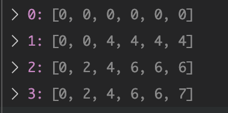

# 二.动态规划重构版
分类方式：
背包，非背包。
背包写全表，字符串写半表
一维，二维，三维 
## 第一类动规问题：背包
根据leetcode上的难度来看，一般面试的难度止步于01背板和完全背包。背包就讲中后面的情况完全不会涉及，当然，我们最好知道后面的多重背包、分组背包等的大致思路，以方便我们进行区分和加深理解。
### [0-1背包](https://www.nowcoder.com/questionTerminal/2820ea076d144b30806e72de5e5d4bbf?f=discussion)
题目描述：有n个物品，它们有各自的体积和价值，现有给定容量的背包，如何让背包里装入的物品具有最大的价值总和？
输入参数：N和W分别是背包能装物体的数量和背包能装的重量。wt数组指的是物体的重量，val指的是对应的价值。
```python
class Solution:
    def knapsack(self , V , n , vw ):
        if V==0 or n==0 or len(vw)==0:return 0
        # write code here
        dp=[[0 for i in range(V+1)] for i in range(n+1)]
        for i in range(1,n+1):
            for w in range(1,V+1):
                if w-vw[i-1][0]<0:
                    dp[i][w]=dp[i-1][w]
                else:
                    dp[i][w]=max(dp[i-1][w],dp[i-1][w-vw[i-1][0]]+vw[i-1][1])
        return dp[n][V]
ss=Solution()
print(ss.knapsack(10,2,[[1,3],[10,4]]))
```
动规的第一步是建立一种状态并且遍历状态，这种想法有点类似于回溯模版的第一步，相当于遍历所有的可能性。但难点在于怎么确定状态所表示的意义。我理解这种状态应该具有一种“归一”性质，即当下的状态可以推导出下一状态，换句话说，当下的状态具有归纳之前状态的特性。
就本题而言，我们建立一个二维数组dp[i][w],状态的含义是到i这个数量为止当前容量下的最大价值。比如说dp[3][5]=6的意思就是在选择前3个物体容量控制在5的时候，最大价值是6。
第一步的难点在于如何定义dp的含义，目前有一种可能猜想是具有一个限制条件就二维,第一个for是个数的循环，第二个是限制条件的循环。如果两个限制条件就变成了三维，for循环依然第一层个数，第二第三层分别是限制条件。
第二步是遍历所有的可能性。
第三步是寻找状态转移。这个转移方程往往采用max这种形式。相当于回溯中的判断和递归函数的操作。第三步的难点在于找到对应的状态转移关系。

*注意：由于本题将物体的重量和价值定义成了一个数组，这样子不便于后续提醒的讨论，我们后面的讨论将采用下面的写法*

```python
def onezerobag(N,W,wt,val):
    dp=[[0 for i in range(W+1)] for i in range(N+1)]
    for i in range(1,N+1):
        for w in range(1,W+1):
            if w-wt[i-1]<0:
                dp[i][w]=dp[i-1][w]
            else:
                dp[i][w]=max(dp[i-1][w-wt[i-1]]+val[i-1],dp[i-1][w])
    return dp[N][W]
print(onezerobag(3,4,[2,1,3],[4,2,3]))
```

#### 01背包的状态压缩（滚动数组）
相比于上面的二维数组解法，更加推荐采用01背包的一维数组解法。有两点原因，其一，一维解法空间复杂度更加小且写起来更加简单；其二，更重要的是，一维解法更加容易迁移到后面的完全背包和多重背包，容易形成模版。
理解为什么二维数组为什么可以转换成一维数组，关键在于理解上面二维数组的状态转移方程是怎么转换成一维数组的。上面的状态转移表达式为
```python
dp[i][w]=max(dp[i-1][w],dp[i-1][w-wt[i-1]]+val[i-1])
```
如下图我们可以发现，如果把dp[i - 1]那一层拷贝到dp[i]上，状态转移表达式可以是：
```python
dp[i][w] = max(dp[i][w],dp[i][w-wt[i]]+ val[i])
```
既然如此，我们就能更进一步，干脆将dp数组直接设置为一维数组。我们可以发现这么做的规律：上一层可以重复利用，可以直接拷贝到当前层的时候。事实上，基本所有背包问题，都符合这个条件。状态转移表达式就是：
```python
dp[w]=max(dp[w],dp[w-wt[i]]+val[i])
```
为了让dp数组数据结构和含义对等，我们理解dp[w]=v的含义就是在w容量下可以取得的最大值，最后的答案就是：
```python
def onezerobag(N,W,wt,val):
    dp=[0 for i in range(W+1)]
    for i in range(N):
        for w in range(W,-1,-1):
            if w>=wt[i]:
                dp[w]=max(dp[w],dp[w-wt[i]]+val[i])
            else:
                break
    return dp[W]
```
接下来我们通过几个问题的思考来加深理解：
1. 为什么要从后往前遍历？
   
2. 两个for循环能不能交换？
   
   2.1 在思考一维解法能不能交换之前，我们先思考二维解法：即交换容量和数量遍历顺序

```python
def onezerobag(N,W,wt,val):
    dp=[[0 for i in range(W+1)] for i in range(N+1)]
    for w in range(W+1):#优先遍历容量
        for i in range(1,N+1):#再遍历数量
            if w<wt[i-1]:
                dp[i][w]=dp[i-1][w]
            else:
                dp[i][w]=max(dp[i-1][w],dp[i-1][w-wt[i-1]]+val[i-1])
    return dp[N][W]
print(onezerobag(3,5,[2,1,3],[4,2,3]))
```
为什么可以交换呢？我们看下面的遍历顺序图：



    2.2 现在的问题是如果是一维的情况下，还可以交换吗？
答案是bu ke yi


### 完全背包
题目描述：在0-1背包中每种物体都只有一个，而在完全背包中，每种物体都有无数个。
输入参数：N和W分别是背包能装物体的数量和背包能装的重量。wt数组指的是物体的重量，val指的是对应的价值。
分析：
虽然说，物体的数量是无限的，由于背包容量有限，所以背包所能放的最大数量是maxw=W/wt[i],所以我们设立第三个循环maxw即可。

例题：[518. 零钱兑换 II](https://leetcode-cn.com/problems/coin-change-2/)
```python

```