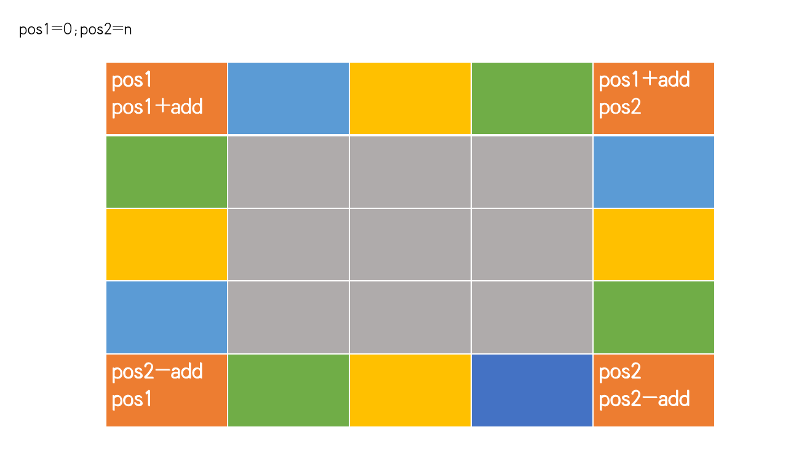

# Hot100
## 2021.1.22 第一周
## [48. 旋转图像](https://leetcode-cn.com/problems/rotate-image/solution/li-kou-48xiao-bai-du-neng-kan-dong-de-fang-fa-zhu-/)[Liu]
这题是一道矩阵旋转类型的题目，本质上是两数交换的高级版.并且矩阵问题有很深的应用，是很好的题。
下图以最外围为例，不同颜色的区块代表了需要置换的区域：



我们来寻找其中的规律，以四个角为例子，我们发现可以采用两个变量来表示四个角。顺时针方向分别是(pos1,pos1),(pos1,pos2),(pos2,po2),(pos2,pos1)。我们只要交换这四个角就可以完成这四个数的交换，之后我们需要一次遍历傍边的数，我们引入一个add来完成这个操作。由于pos1+add< pos2，我们找到了循环结束条件。


外圈循环结束之后，我们进入里圈。我们将pos1+1,pos2-1自然就进入了里圈。循环结束条件是pos1< pos2。
```python
def rotate(matrix):
    pos1,pos2=0,len(matrix)-1
    while pos1<pos2:
        add=0
        while add<pos2-pos1:
            temp=matrix[pos1+add][pos2]
            matrix[pos1+add][pos2]=matrix[pos1][pos1+add]
            matrix[pos1][pos1+add]=matrix[pos2-add][pos1]
            matrix[pos2-add][pos1]=matrix[pos2][pos2-add]
            matrix[pos2][pos2-add]=temp
            add+=1
        pos1+=1
        pos2-=1
# matrix=[[1,2,3],[4,5,6],[7,8,9]] demo1
matrix=[[ 5, 1, 9,11],[ 2, 4, 8,10],[13, 3, 6, 7],[15,14,12,16]]#demo2
print(rotate(matrix))
```

当然由于python的特性，我们也可以不要temp:
```python
def rotate(matrix):
    pos1=0
    pos2=len(matrix)-1
    while pos1<pos2:
        add=0
        while pos1+add<pos2:
            matrix[pos1+add][pos2],matrix[pos2][pos2-add],matrix[pos2-add][pos1],matrix[pos1][pos1+add]=matrix[pos1][pos1+add],matrix[pos1+add][pos2],matrix[pos2][pos2-add],matrix[pos2-add][pos1]
            add+=1
        pos1+=1
        pos2-=1
matrix=[[ 5, 1, 9,11],[ 2, 4, 8,10],[13, 3, 6, 7],[15,14,12,16]]
print(rotate(matrix))
```
但不建议这么写，一是可读性太差了，二是不利于调试。

## [75. 颜色分类](https://leetcode-cn.com/problems/sort-colors/)[Li]

```python
# 75. 颜色分类
# [题解](https://leetcode-cn.com/problems/sort-colors/solution/kuai-su-pai-xu-partition-guo-cheng-she-ji-xun-huan/)
def sortColors(nums):
    p0=cur=0 #p0用来交换0，cur遍历指针事实上就是指向1
    p2=len(nums)-1#p2用来交换2
    while cur<p2:
        if nums[cur]==0:
            nums[cur],nums[p0]=nums[p0],nums[cur]
            cur+=1
            p0+=1
        elif nums[cur]==1:
            cur+=1
        else:
            nums[cur],nums[p2]=nums[p2],nums[cur]
            p2-=1
    return nums
print(sortColors([2,0,2,1,1,0]))
```
## 2021.1.23
[55 跳跃游戏](https://leetcode-cn.com/problems/jump-game/)[Li]

这道题很简单，关键是要借鉴动态规划的方法，每一步只要可以求出到此位置的剩余最大跳跃次数就可以。
```python
class Solution:
    def canJump(self, nums):
        dp = 1
        for i in range(len(nums)-1):
            dp = max(nums[i],dp-1)
            if dp==0: return False
        return True
```
当然，这题也有一个让人十分容易绕进去的点，观察下面的错误写法和上面的写法有什么不同：
```python
class Solution:
    def canJump(self, nums):
        dp=1
        for i in nums:
            dp=max(dp-1,i)
            if dp==0:
                return False
        return True
```
唯一的区别在于for循环。事实上我们观察测试用例[1,0,1,0]，其实第一个0和第二个0是有显著区别的，在第一个0位置我们必须要保证大于1，而在最后一个0我们只需要到达即可，所以最后一个数其实是不能被考虑进来的。


[198 打家劫舍](https://leetcode-cn.com/problems/house-robber/)[Ye]
```python
def rob(nums):
    if len(nums)==0:return 0
    if len(nums)==1:return nums[0]
    dp=[0 for i in range(len(nums)+1)]
    dp[1]=nums[0]
    for i in range(2,len(nums)+1):
        dp[i]=max(dp[i-1],dp[i-2]+nums[i-1])
    return dp[-1]
a=[2,7,9,3,1]
print(rob(a))
```
[215. 数组中的第K个最大元素](https://leetcode-cn.com/problems/kth-largest-element-in-an-array/)
```python
class Solution:
    def findKthLargest(self, nums: List[int], k: int) -> int:
        def HeapAdjust(nums,k,n):
            while(2*k+1<n):
                j=2*k+1
                if j+1<n and nums[j]<nums[j+1]:
                    j=j+1
                if nums[j]>nums[k]:
                    temp=nums[k]
                    nums[k]=nums[j]
                    nums[j]=temp
                    k=j
                else:
                    break
            return nums
        n=len(nums)
        for i in range(int(n/2)-1,-1,-1):
            nums=HeapAdjust(nums,i,n)
        for i in range(n-1,n-k,-1):
            nums[0],nums[i]=nums[i],nums[0]
            nums=HeapAdjust(nums,0,i)
        return nums[0]

```
[347. 前 K 个高频元素](https://leetcode-cn.com/problems/top-k-frequent-elements/)[Liu]
这两题参考./sorted
```python
class Solution:
    def topKFrequent(self, nums: List[int], k: int) -> List[int]:
        counter = collections.Counter(nums)
        val = list(counter.keys())
        l, r = 0, len(val) - 1
        while l <= r:
            pivot = self.partition(val, l, r, counter)
            if pivot == k - 1:
                return val[:k]
            if pivot > k - 1:
                r = pivot - 1
            else:
                l = pivot + 1

    def partition(self, val, l, r, counter):
        pivot = r
        right = l
        for i in range(l, r):
            if counter.get(val[i]) >= counter.get(val[pivot]):
                val[i], val[right] = val[right], val[i]
                right += 1
        val[right], val[pivot] = val[pivot], val[right]
        return right
```

## 2021.1.26
[102. 二叉树的层序遍历](https://leetcode-cn.com/problems/binary-tree-level-order-traversal/)[Liu]
```python
import Tree
class Solution:
    def levelOrder(self, root) :
        if not root:return []
        quene=[]
        quene.append(root)
        res=[]
        while quene:
            temp=[]
            for i in range(len(quene)):
                node=quene.pop(0)
                if node:
                    temp.append(node.val)
                    if node.left:
                        quene.append(node.left)
                    if node.right:
                        quene.append(node.right)
            res.append(temp[:])
        return res
tt=Tree.TreeNodeTools()
root3=tt.createTreeByrow('[3,9,20,null,null,15,7,null,null,null,null]')
ss=Solution()
print(ss.levelOrder(root3))
```

[206. 反转链表](https://leetcode-cn.com/problems/reverse-linked-list/)[Li]
```python
#迭代
class Solution:
    def reverseList(self, head: ListNode) -> ListNode:
        if not head:
            return None
        pre,cur = head,head.next
        pre.next = None
        while cur:
            temp = cur.next
            cur.next= pre
            pre,cur = cur,temp
        return pre
#递归
import List
def reverse(llist):
    if not llist or not llist.next:return llist
    end=reverse(llist.next)
    llist.next.next=llist
    llist.next=None
    return end
ll=List.ListNodeTools()
llist=ll.create([1,2,3,4,5])
# ll.printf(llist)
print(ll.printf(reverse(llist)))
```

[287. 寻找重复数](https://leetcode-cn.com/problems/find-the-duplicate-number/)[Ye]
```python

class Solution:
    def findDuplicate(self, nums: List[int]) -> int:
        size = len(nums)
        left = 1
        right = size - 1
        while left < right:
            mid = left + (right - left) // 2
            cnt = 0
            for num in nums:
                if num <= mid:
                    cnt += 1
            # 根据抽屉原理，小于等于 4 的数的个数如果严格大于 4 个，
            # 此时重复元素一定出现在 [1, 4] 区间里
            if cnt > mid:
                # 重复的元素一定出现在 [left, mid] 区间里
                right = mid
            else:
                # if 分析正确了以后，else 搜索的区间就是 if 的反面
                # [mid + 1, right]
                left = mid + 1
        return left
```

### 2021.1.28 第二周
[104. 二叉树的最大深度](https://leetcode-cn.com/problems/maximum-depth-of-binary-tree/)
[543. 二叉树的直径](https://leetcode-cn.com/problems/diameter-of-binary-tree/)[Liu]

先看一下树高怎么求：
```python
import Tree
def deeptree(root):
    if not root:return 0
    left=deeptree(root.left)
    right=deeptree(root.right)
    return max(left,right)+1
```
然后改成求最大直径：
```python
import Tree
class Solution:
    def diameterOfBinaryTree(self, root) -> int:
        if not root:return 0
        self.ans=1
        def roothigh(root):
                if not root:
                    return 0
                left=roothigh(root.left)
                right=roothigh(root.right)
                self.ans=max(self.ans,left+right+1)
                return max(left,right)+1
        roothigh(root)
        return self.ans-1
ss=Solution()
ss1=Tree.TreeNodeTools()
root=ss1.createTreeByrow("[1,2,3,4,5,null,null,null,null,null,null]")
print(ss.diameterOfBinaryTree(root))
```

[148. 排序链表](https://leetcode-cn.com/problems/sort-list/)[Li]
```python
#链表快排（超时）
class Solution:
    def sortList(self, head: ListNode) -> ListNode:
        if not head:
            return None
        right = head
        while right.next:
            right=right.next
        def partition(head,left,right):
            povit=right.val
            temp=pre =cur=left
            while cur!=right:
                if povit>cur.val:
                    pre.val,cur.val = cur.val,pre.val
                    temp = pre
                    pre = pre.next
                cur = cur.next
            pre.val,right.val=right.val,pre.val
            return temp,pre    

        def quicksort(head,left,right):
            if left!=right:
                temp,pre=partition(head,left,right)
                if pre!=right:
                    quicksort(head,pre.next,right)
                quicksort(head,left,temp)
            return head
        return quicksort(head,head,right)

#归并排序 自上而下
class Solution:
    def sortList(self, head: ListNode) -> ListNode:
        if not head or not head.next: 
            return head
        slow = head
        fast = head
        # 用快慢指针分成两部分
        while fast.next and fast.next.next:
            slow = slow.next
            fast = fast.next.next
        # 找到左右部分, 把左部分最后置空
        mid = slow.next
        slow.next = None
        # 递归下去
        left = self.sortList(head)
        right = self.sortList(mid)
        # 合并
        return self.merge(left, right)

    def merge(self, left, right):
        dummy = ListNode(0)
        p = dummy
        l = left
        r = right

        while l and r:
            if l.val < r.val:
                p.next = l
                l = l.next
                p = p.next
            else:
                p.next = r
                r = r.next
                p = p.next
        if l:
            p.next = l
        if r:
            p.next = r
        return dummy.next
```
[337打家劫舍III](https://leetcode-cn.com/problems/house-robber-iii/)[Ye]
```python
class Solution:
    def rob(self, root: TreeNode) -> int:
        def _rob(root):
            if not root: return 0, 0  # 偷，不偷
            left = _rob(root.left)
            right = _rob(root.right)
        # 偷当前节点, 则左右子树都不能偷
            v1 = root.val + left[1] + right[1]
        # 不偷当前节点, 则取左右子树中最大的值
            v2 = max(left) + max(right)
            return v1, v2
        return max(_rob(root))
```
### 2021.1.30
[1. 两数之和](https://leetcode-cn.com/problems/two-sum/)

[15. 三数之和](https://leetcode-cn.com/problems/3sum/)[Liu]
首先求出两数之和：

```python
def twosum(nums,target):
    nums.sort()
    left=0
    right=len(nums)-1
    while left<=right:
        if nums[left]+nums[right]>target:
            right-=1
        elif nums[left]+nums[right]<target:
            left+=1
        else:
            return [left,right]
    return False
nums=[3,2,4]
print(twosum(nums,6))
```
由于本题要求我们求出的是索引值，所以我们来修改一下：
```python
def twosum(nums,target):
    # nums.sort()
    number=[]
    for i in range(len(nums)):
        number.append((nums[i],i)) 
    number.sort()
    left=0
    right=len(nums)-1
    while left<=right:
        if number[left][0]+number[right][0]>target:
            right-=1
        elif number[left][0]+number[right][0]<target:
            left+=1
        else:
            return [number[left][1],number[right][1]]
    return False
nums=[3,3]
print(twosum(nums,6))
```

在两数的基础上再求三数之和：
```python
def twosum(nums,target):
    left=0
    right=len(nums)-1
    res=[]
    while left<right:
        if nums[left]+nums[right]>target:
            right-=1
        elif nums[left]+nums[right]<target:
            left+=1
        else:
            res.append([nums[left],nums[right]])
            left+=1
            right-=1
    return res

def treesum(nums):
    nums.sort()
    res=[]
    for i in range(len(nums)):
        tt=twosum(nums[i+1:],-nums[i])
        for t in tt:
            tem=[nums[i]]+t
            if tem not in res:
                res.append(tem)
    return res

nums=[-2,0,1,1,2]
print(treesum(nums))
```
3sum解决了,那么nsum怎么解答，比如n==100？

最后来讲讲二分查找的三种写法：
```python
#二分查找经典写法
def binaysearch(nums,target):
        left=0
        right=len(nums)-1
        while left<=right: 
                mid=left+(right-left)//2 
                if nums[mid]<target:
                        left=mid+1
                elif nums[mid]>target:
                        right=mid-1
                elif nums[mid]==target:
                         return mid
        return -1
num=[1,2,3,9,10,45]
print(binaySearch(num,45))

#下面做边界和右边界问题
def rightbinaysearch(nums,target):
        left=0
        right=len(nums)-1
        while left<=right:
                mid=left+(right-left)//2
                if nums[mid]<target:
                        left=mid+1
                elif nums[mid]>target:
                        right=mid-1
                elif nums[mid]==target:
                        left=mid+1
        # if left>=len(nums) or nums[left]!=target:
        #         return -1
        if right<0 or nums[right]!=target:
                return -1
        return right

def leftbinaysearch(nums,target):
        left=0
        right=len(nums)-1
        while left<=right:
                mid=left+(right-left)//2
                if nums[mid]<target:
                        left=mid+1
                elif nums[mid]>target:
                        right=mid-1
                elif nums[mid]==target:
                        right=mid-1
        if left>=len(nums) or nums[left]!=target:
                return -1
        return left

```

[221.最大正方形](https://leetcode-cn.com/problems/maximal-square/)[Ye]
```python
def maximalSquare(matrix) -> int:
    dp = [[0 for i in range(len(matrix[0]))] for i in range(len(matrix))]
    #首先把第一行和第一列都赋值到dp数组里面,这道题要注意输入的都是char要转换成int
    for i in range(len(dp)):
        dp[i][0] = int(matrix[i][0])
    for i in range(len(dp[0])):
        dp[0][i] = int(matrix[0][i])
    #如果周围三个都是1，那么就加1
    for i in range(1, len(dp)):
        for j in range(1, len(dp[0])):
            dp[i][j] = int((matrix[i][j]))
            if (matrix[i][j] == '1' and matrix[i][j - 1] == '1' and matrix[i - 1][j] == '1' and matrix[i - 1][j - 1] == '1'):
                dp[i][j] = min(dp[i - 1][j - 1], dp[i - 1][j], dp[i][j - 1]) + 1
    #按照列取最大值后平方
    return max(map(max, dp))**2
print(maximalSquare([["1","0","1","0","0"],["1","0","1","1","1"],["1","1","1","1","1"],["1","0","0","1","0"]]))
```

[9.删除链表的倒数第 N 个结点](https://leetcode-cn.com/problems/remove-nth-node-from-end-of-list/)[Li]
```python
#19.删除链表的倒数第 N 个结点
# Definition for singly-linked list.
# class ListNode:
#     def __init__(self, val=0, next=None):
#         self.val = val
#         self.next = next
class Solution:
    def removeNthFromEnd(self, head: ListNode, n: int) -> ListNode:
        node = ListNode(0)
        node.next = head 
        
        #step1: 快指针先走n步
        slow, fast = node, node
        for _ in range(n):
            fast = fast.next 

        #step2: 快慢指针同时走，直到fast指针到达尾部节点，此时slow到达倒数第N个节点的前一个节点
        while fast and fast.next:
            slow, fast = slow.next, fast.next 
        
        #step3: 删除节点，并重新连接
        slow.next = slow.next.next 
        return node.next 
```

### 2021.2.2
[236. 二叉树的最近公共祖先](https://leetcode-cn.com/problems/lowest-common-ancestor-of-a-binary-tree/)[Liu]

```python
def lowestCommonAncestor(root,p,q):
    if root==None:return None
    if root==p or root==q:
        return root
    left=lowestCommonAncestor(root.left,p,q)
    right=lowestCommonAncestor(root.right,p,q)
    #两个都有，根据后续遍历的特点root就是两个的前一个节点
    if left!=None and right!=None:
        return root
    #两个都不存在返回none
    if left==None and right==None:
        return None
    #一个存在一个不存在说明存在的那个是公共祖先
    return right if left==None else left

import Tree
ss=Tree.TreeNodeTools()
root=ss.createTreeByrow([3,5,1,6,2,0,8,'null','null',7,4],0)
t5=root.left
t4=root.left.right.right
t1=root.right
print(lowestCommonAncestor(root,t5,t4).val)
```

[5. 最长回文子串](https://leetcode-cn.com/problems/longest-palindromic-substring/)[Li]

```python
class Solution:
    def longestPalindrome(self, s: str) -> str:
        n = len(s)
        dp = [[False] * n for _ in range(n)]
        ans = ""
        for j in range(n):
            for i in range(j+1):
                #这个相当于自己肯定是回文
                if i==j:
                    dp[i][j]=True
                #这个相当于2个的情况，回文与否取决于两个是否相等
                elif i==j-1:
                    dp[i][j]=(s[i]==s[j])
                #这个相当于两头相等的情况下，中间是回文就是回文
                else:
                    dp[i][j]=(s[i]==s[j] and dp[i+1][j-1])
                #当前是后文，而且大于ans就记录下来
                if dp[i][j] and j-i+1>len(ans):
                    ans=s[i:j+1]
        return ans
```

[11. 盛最多水的容器](https://leetcode-cn.com/problems/container-with-most-water/)[Ye]
```python
def compute(height):
    left=0
    right=len(height)-1
    res=0
    while left<right:
        if height[left]<height[right]:
            res=max(res,(right-left)*height[left])
            left+=1
        else:
            res=max(res,(right-left)*height[right])
            right-=1
    return res
print(compute([1,8,6,2,5,4,8,3,7]))
```

### 2021.2.4 第三周
[146. LRU 缓存机制](https://leetcode-cn.com/problems/lru-cache/)[Li]
```python
class DLinkedNode:
    def __init__(self, key=0, value=0):
        self.key = key
        self.value = value
        self.prev = None
        self.next = None
class LRUCache:
    def __init__(self, capacity: int):
        self.cache = dict()
        # 使用伪头部和伪尾部节点    
        self.head = DLinkedNode()
        self.tail = DLinkedNode()
        self.head.next = self.tail
        self.tail.prev = self.head
        self.capacity = capacity
        self.size = 0
    def get(self, key: int) -> int:
        if key not in self.cache:
            return -1
        # 如果 key 存在，先通过哈希表定位，再移到头部
        node = self.cache[key]
        self.moveToHead(node)
        return node.value

    def put(self, key: int, value: int) -> None:
        if key not in self.cache:
            # 如果 key 不存在，创建一个新的节点
            node = DLinkedNode(key, value)
            # 添加进哈希表
            self.cache[key] = node
            # 添加至双向链表的头部
            self.addToHead(node)
            self.size += 1
            if self.size > self.capacity:
                # 如果超出容量，删除双向链表的尾部节点
                removed = self.removeTail()
                # 删除哈希表中对应的项
                self.cache.pop(removed.key)
                self.size -= 1
        else:
            # 如果 key 存在，先通过哈希表定位，再修改 value，并移到头部
            node = self.cache[key]
            node.value = value
            self.moveToHead(node)
    def addToHead(self, node):
        node.prev = self.head
        node.next = self.head.next
        self.head.next.prev = node
        self.head.next = node
    
    def removeNode(self, node):
        node.prev.next = node.next
        node.next.prev = node.prev

    def moveToHead(self, node):
        self.removeNode(node)
        self.addToHead(node)

    def removeTail(self):
        node = self.tail.prev
        self.removeNode(node)
        return node
    def printf(self):
        for k,v in self.cache.items():
            print(k,v.value)
ss=LRUCache(3)
ss.put(1,2)
ss.put(2,3)
ss.put(3,4)
ss.put(4,5)
# ss.printf()
print(ss.get(3))
ss.put(6,7)
ss.put(7,8)
ss.printf()

```

[739. 每日温度](https://leetcode-cn.com/problems/daily-temperatures/)[Li]
```python
class Solution:
    def dailyTemperatures(self, T) :
        res = [0 for _ in T]
        stack = []
        for i in range(len(T)):
            while stack and T[i]>T[stack[-1]]:
                topIndex = stack.pop()
                res[topIndex]=i-topIndex
            stack.append(i)
        return res
```

[240. 搜索二维矩阵 II](https://leetcode-cn.com/problems/search-a-2d-matrix-ii/)[Ye]
```python
#240搜索二维矩阵 方法二
def searchMatrix(matrix, target):
    if not matrix:
        return False
    def search_rec(left, up, right, down):
        if left > right or up > down:
            return False
        # 如果target比矩阵最小值还小，或比最大值还大
        elif target < matrix[up][left] or target > matrix[down][right]:
            return False
        mid = left + (right - left) // 2

        row = up
        while row <= down and matrix[row][mid] <= target:
            if matrix[row][mid] == target:
                return True
            row += 1
        return search_rec(left, row, mid - 1, down) or search_rec(mid + 1, up, right, row - 1)
    return search_rec(0, 0, len(matrix[0]) - 1, len(matrix) - 1)

#240搜索二维矩阵 方法三
class Solution:
    def searchMatrix(self, matrix: List[List[int]], target: int) -> bool:
        left=len(matrix[0])-1
        up=0
        while(up<len(matrix) and left>=0):
            if matrix[up][left]==target:
                return True
            if matrix[up][left]>target:
                left-=1
            else:
                up+=1
        return False
```
叶题解：

### 2021.2.5
[114. 二叉树展开为链表](https://leetcode-cn.com/problems/flatten-binary-tree-to-linked-list/)[Liu]
拿到这道题，马上想到二叉树的DFS遍历，两种：递归的和非递归的。非递归的很简单不表。
递归也有两种方法，第一种我们可以设立list来记录，然后将list转成链表，可是多了个循环太不优雅了。
第二种在递归中将链表拼接起来，这个方法要脑子非常清楚递归的顺序,同时也要明白在向上递归的时候root会被覆。，所以要设立一个全局指针，这个和设立list来记录值是不同的，List的话天然就是一个全局的变量。
```python
from Tree import TreeNode,TreeNodeTools
class Solution:
    def flatten(self, root: TreeNode) -> None:
        if not root:return []
        temp=TreeNode()
        res=temp
        def dfs(root):
            nonlocal temp
            if not root:return 
            temp.right=TreeNode(root.val)
            temp=temp.right
            dfs(root.left)
            dfs(root.right)
        dfs(root)
        root.right=res.right.right
        root.left=None
ss=Solution()
root=TreeNodeTools().createTreeByrow('[1,2,5,3,4,null,6,null,null,null,null,null,null]')
ss.flatten(root)
```

[279. 完全平方数](https://leetcode-cn.com/problems/perfect-squares/)[Ye]
本题是一个完全背包问题。
```python
class Solution:
    def numSquares(self, n: int) -> int:
        dp=[[]for _ in range(n+1)]
        dp[0]=0
        for i in range(1,n+1):
            dp[i]=i
            for j in range(1,n):
                t=j*j
                if (t<=i):#小于等于！！
                    dp[i]=min(dp[i-t]+1,dp[i]) 
                else:
                    break                         
        return dp[-1]
```

[155.最小栈](https://leetcode-cn.com/problems/min-stack/)[Li]
看到这题的第一眼往往会以为，只要用一个变量就可以得到最小值。事实上，当最小值pop出栈的时候，如果但用一个变量的话，我们就不能得到倒数第二小的值了。本题用了一个很巧妙的方法，同时存储值和当前的最小值。
```python
class MinStack:
    def __init__(self):
        """
        initialize your data structure here.
        """
        self.stack = []

    def push(self, x: int) -> None:
        if not self.stack:
            self.stack.append([x,x])
        else:
            self.stack.append([x,min(self.stack[-1][1],x)])
    def pop(self) -> None:
        self.stack.pop()

    def top(self) -> int:
        return self.stack[-1][0]

    def getMin(self) -> int:
        return self.stack[-1][1]
```
### 2021.2.9
[208. 实现 Trie (前缀树)](https://leetcode-cn.com/problems/implement-trie-prefix-tree/)
```python
class Trie:

    def __init__(self):
        """
        Initialize your data structure here.
        """
        self.lookup = {}
        

    def insert(self, word: str) -> None:
        """
        Inserts a word into the trie.
        """
        tree = self.lookup
        for a in word:
            if a not in tree:
                tree[a] = {}
            tree = tree[a]
        # 单词结束标志
        tree["#"] = "#"
        

    def search(self, word: str) -> bool:
        """
        Returns if the word is in the trie.
        """
        tree = self.lookup
        for a in word:
            if a not in tree:
                return False
            tree = tree[a]
        if "#" in tree:
            return True
        return False
        

    def startsWith(self, prefix: str) -> bool:
        """
        Returns if there is any word in the trie that starts with the given prefix.
        """
        tree = self.lookup 
        for a in prefix:
            if a not in tree:
                return False
            tree = tree[a]
        return True
trie=Trie()
trie.insert("apple")
trie.insert("appue")
print(trie.startsWith("appu"))
```
总结：
整个Trie是一个用dict来建立的多叉树，其关键是三个函数，分别为：[建立Trie],[搜索Trie中包含单词],[搜索Trie中包含前缀]。通过观察我们发现三个函数本质上是一样的，都是遍历输入的参数，判断单个元素是否存在在Trie中。[建立Trie]阶段要注意最后要添加“#”，[搜索Trie中包含单词]搜索完成的标志就是找到了“#”，[搜索Trie中包含前缀]阶段找到不在trie中的值就是返回错误，不然就是正确的。

用到了前缀树的题目：
[211. 添加与搜索单词 - 数据结构设计](https://leetcode-cn.com/problems/design-add-and-search-words-data-structure/)
[212. 单词搜索 II](https://leetcode-cn.com/problems/word-search-ii/)
[421. 数组中两个数的最大异或值](https://leetcode-cn.com/problems/maximum-xor-of-two-numbers-in-an-array/)


[84 柱状图中最大的矩形](https://leetcode-cn.com/problems/largest-rectangle-in-histogram/)[Ye]

本题用了单调栈，在左右添加0。当右边的柱子大于左边的柱子的时候入栈，当右边的柱子小于左边的柱子的时候出栈并计算面积。
```python
class Solution:
    def largestRectangleArea(self, heights) -> int:
        stack=[]
        heights=[0]+heights+[0]
        res=0
        for i in range(len(heights)):
            while stack and heights[stack[-1]] > heights[i]:
                tmp=stack.pop()
                res=max(res, (i - stack[-1] - 1) * heights[tmp])
            stack.append(i)
        return res
```

[394.字符串解码](https://leetcode-cn.com/problems/decode-string/)[Li]
这题也是用了一种栈的结构，当发现数字的时候就重复，当字母的时候就添加到res中。"[" 添加 "]"弹出。
```python
class Solution:
    def decodeString(self, s: str) -> str:
        stack,multi,res=[],0,''
        for i in s:
            if i=='[':
                stack.append([multi,res])
                multi,res=0,''
            elif i==']':
                pre_multi,pre_res = stack.pop()
                res = pre_res+pre_multi*res
            elif '0'<=i<='9':
                multi= 10*multi+int(i)
            else:
                res+=i
        return res
```

### 2021.2.11
[297. 二叉树的序列化与反序列化](https://leetcode-cn.com/problems/serialize-and-deserialize-binary-tree/)[Liu]
这题的题解在tree.md中
```python
class TreeNode:
    def __init__(self,x=0):
        self.val=x
        self.left=None
        self.right=None
class Codec:
    def serialize(self, root):
        if not root: return "[]"
        queue = []
        queue.append(root)
        res = []
        while queue:
            node = queue.pop(0)
            if node:
                res.append(str(node.val))
                queue.append(node.left)
                queue.append(node.right)
            else: res.append("null")
        return '[' + ','.join(res) + ']'

    def deserialize(self, data):
        if data=='[]':
            return None
        vals, i = data[1:-1].split(','), 1
        root = TreeNode(int(vals[0]))
        queue = []
        queue.append(root)
        while queue:
            node = queue.pop(0)
            if vals[i] != "null":
                node.left = TreeNode(int(vals[i]))
                queue.append(node.left)
            i += 1
            if vals[i] != "null":
                node.right = TreeNode(int(vals[i]))
                queue.append(node.right)
            i += 1
        return root


ser = Codec()
deser = Codec()
root=deser.deserialize("[1,2,3,null,null,4,5,null,null,null,null]")

ans=ser.serialize(root)
print(ans)
print(deser.deserialize(ans))
```

[42. 接雨水](https://leetcode-cn.com/problems/trapping-rain-water/)[Li]
```python
#42.接雨水
class Solution:
    def trap(self, height: List[int]) -> int:
        stack,res = [],0
        for i in range(len(height)):
            while stack and height[i]>height[stack[-1]]:
                bottom = stack.pop()
                if not stack: break
                res += (min(height[stack[-1]],height[i])-height[bottom])*(i-stack[-1]-1)
            stack.append(i)
        return res
```

[85 最大矩形](https://leetcode-cn.com/problems/maximal-rectangle/)[Ye]
```python
class Solution:
    def maximalRectangle(self, matrix: List[List[str]]) -> int:
        if not matrix: return 0
        h,w=len(matrix),len(matrix[0])
        # 记录当前位置上方连续“1”的个数
        heights = [0] * (w + 2)
        res = 0
        for i in range(h):
            for j in range(1, w + 1):
                heights[j] = heights[j] + 1 if matrix[i][j - 1] == "1" else 0
            # 单调栈
            stack = []
            for k in range(len(heights)):
                while stack and heights[stack[-1]] > heights[k]:
                    tmp = stack.pop()
                    res = max(res, heights[tmp] * (k - stack[-1] - 1))
                stack.append(k)
        return res
```

### 2021.2.13 
[96. 不同的二叉搜索树](https://leetcode-cn.com/problems/unique-binary-search-trees/)
什么是二叉搜索树？
二叉搜索树是一种节点值之间具有一定数量级次序的二叉树，对于树中每个节点：
若其左子树存在，则其左子树中每个节点的值都不大于该节点值；
若其右子树存在，则其右子树中每个节点的值都不小于该节点值。

我们可以想想【1，2，3，4，5】这样一个数组有几种可能性。我们只需要分别以数组中的数作为根节点，然后将左右分别组成搜索二叉树即可，所以整个程序是一个递归的程序。

```python
def compute(n):
    def count(lo,hi):
        if lo>hi:return 1
        res=0
        for i in range(lo,hi+1):
            left=count(lo,i-1)
            right=count(i+1,hi)
            res+=right*left
        return res
    return count(1,n)
print(compute(3))
```
接下来我们用一个备忘录来改造这个题，就是将每一次的结果先保留下来，下次就不用再计算了。
```python
def compute(n):
    memo=[[0 for i in range(n+1)]for i in range(n+1)]
    def count(lo,hi):
        if lo>hi:return 1
        if memo[lo][hi]!=0:
            return memo[lo][hi]
        res=0
        for i in range(lo,hi+1):
            left=count(lo,i-1)
            right=count(i+1,hi)
            res+=left*right
        memo[lo][hi]=res
        return res 
    return count(1,n)
print(compute(3))
```
事实上这是卡塔兰数 C_nCn
```python
class Solution(object):
    def numTrees(self, n):
        """
        :type n: int
        :rtype: int
        """
        C = 1
        for i in range(0, n):
            C = C * 2*(2*i+1)/(i+2)
        return int(C)
```


最后进阶一下[不同的二叉搜索树 II](https://leetcode-cn.com/problems/unique-binary-search-trees-ii/)
本题不是求数量了，而是要具体求出所有的可能的树。
```python
class TreeNode:
    def __init__(self,x=0):
        self.val=x
        self.left=None
        self.right=None
class Solution:
    def generateTrees(self, n: int):
        def count(lo,hi):
            if lo>hi:
                return [None,]
            allTrees=[]
            for i in range(lo,hi+1):
                left=count(lo,i-1)
                right=count(i+1,hi)
                for l in left:
                    for r in right:
                        currTree=TreeNode(i)
                        currTree.left=l
                        currTree.right=r
                        allTrees.append(currTree)
            return allTrees
        return count(1,n) if n else []
ss=Solution()
print(ss.generateTrees(3))
```
[617. 合并二叉树](https://leetcode-cn.com/problems/merge-two-binary-trees/)[Li]
```python
class Solution:
    def mergeTrees(self, root1: TreeNode, root2: TreeNode) -> TreeNode:
        if not root1:return root2
        if not root2:return root1
        mergeNode=TreeNode(root1.val+root2.val)
        mergeNode.left=self.mergeTrees(root1.left,root2.left)
        mergeNode.right=self.mergeTrees(root1.right,root2.right)
        return mergeNode
```

[64. 最小路径和](https://leetcode-cn.com/problems/minimum-path-sum/)[Ye]
```python
class Solution:
    def minPathSum(self, grid: [[int]]) -> int:
        for i in range(len(grid)):
            for j in range(len(grid[0])):
                if i == j == 0: continue
                elif i == 0:  grid[i][j] = grid[i][j - 1] + grid[i][j]
                elif j == 0:  grid[i][j] = grid[i - 1][j] + grid[i][j]
                else: grid[i][j] = min(grid[i - 1][j], grid[i][j - 1]) + grid[i][j]
        return grid[-1][-1]
```

### 2021.2.20
[105. 从前序与中序遍历序列构造二叉树](https://leetcode-cn.com/problems/construct-binary-tree-from-preorder-and-inorder-traversal/)
```python
class Solution:
    def buildTree(self, preorder: List[int], inorder: List[int]) -> TreeNode:
        if not preorder or not inorder:
            return None
        root=TreeNode(preorder[0])
        mid_idx=inorder.index(preorder[0])
        #root.left=self.buildTree(preorder[1:mid_idx+1],inorder[:mid_idx])
        #对于preorder[1:mid_idx+1]截取preoder的前半部分其实只需要preorder[1:]就可以，mid_id+1也不会错
        root.left=self.buildTree(preorder[1:mid_idx+1],inorder[:mid_idx])
        root.right=self.buildTree(preorder[mid_idx+1:],inorder[mid_idx+1:])
        return root
```
通过这道题我有一个感想，设计递归程序有一个反思维的地方。在人的思维中“同时”是一个很容易理解的问题，我们经常同时处理一些事情，同时听歌读书。很好理解，但是对于我们的算法代码程序（单线程单核）而言并不存在同时这一点，cpu一次只能处理一件事情。所以说我们借用递归或者说栈这种结构，本质上是用来将一件思考上需要同时的事情分解开来，将上一个状态存储下来，先处理下一个状态，再择机处理之前存储的状态，这就是栈最大的作用。本题递归本质上仅仅相当于一个栈的简单应用，我们也可以通过返回值的改变实现单调栈，辅助栈。
[106.从中序与后序遍历序列构造二叉树](https://leetcode-cn.com/problems/construct-binary-tree-from-inorder-and-postorder-traversal/)[待补充]

[338. 比特位计数](https://leetcode-cn.com/problems/counting-bits/)[Li]

```python
class Solution:
    def countBits(self, num: int) -> List[int]:
        bits=[0]
        n=1
        for i in range(1,num+1):
            if i==2*n:   #当i为进位数（1，2，4）
                n*=2      #使n乘2变成下一个进位数
            bits.append(bits[i-n]+1)     #当前i的二进制中1的个数为i-n的1个数加1，即在i-n二进制左端加1变为i
        return bits
```

[39、组合总和](https://leetcode-cn.com/problems/combination-sum/submissions/)
```python
class Solution:
    def combinationSum(self, candidates: List[int], target: int) -> List[List[int]]:
        dp=[[[] for _ in range(target+1)] for _ in range(len(candidates)+1)]
        for i in range(1,len(dp)):
            q=candidates[i-1]
            for j in range(1,len(dp[0])):
                dp[i][j]=dp[i-1][j][:]
                if j==q:
                    dp[i][j].append([q])
                if j>q and dp[i][j-q]!=[]:
                    for k in dp[i][j-q]:
                        dp[i][j].append(k+[q])
        return dp[-1][-1]
```

### 2021.2.23
[124. 二叉树中的最大路径和](https://leetcode-cn.com/problems/binary-tree-maximum-path-sum/)[Liu]
```python
class Solution:
    def maxPathSum(self, root: TreeNode) -> int:
        self.ans=-1001
        def depth(root):
            if not root: return 0
            L = max(depth(root.left),0)
            R = max(depth(root.right),0)
            self.ans = max(self.ans, L + R + root.val)
            return max(L, R)+root.val
        depth(root)
        return self.ans
```
通过tree总结模版，一看到这道题，马上意识到这题属于遍历型题。想到这不就是一个dfs，然后采用中序遍历了一下例二的树。得到[9,-10,15,20,7],然后想到这不就是一个最大子数组的问题嘛。故采用以下代码试了一下：
```python
#错误答案，不能通过所有案例
class Solution:
    def maxPathSum(self, root: TreeNode) -> int:
        dp=[-1001]
        i=0
        def dfs(root):
            nonlocal i
            if not root:return
            dfs(root.left)
            dp.append(root.val)
            i+=1
            dp[i]=max(root.val,dp[i-1]+root.val)
            dfs(root.right)
        dfs(root)
        return max(dp)
```
可以是又一个案例没有通过,[1,-2,-3,1,3,-2,null,-1],输出应该是3我输出了4。原因是中序dfs的结果是[-1,1,-2,3,1,-2,-3]而在这个树中，3和1不是连在一起的。这时才意识到这不是一个遍历的题目。由于树除了特殊树之外只有两种出题的可能，不是遍历那就是树高型的题。从这个方向想了一下果然如此。首先考虑求树的最大直径这道题：
```python
import Tree
class Solution:
    def diameterOfBinaryTree(self, root) -> int:
        self.ans = 1
        def depth(root):
            if not root: return 0
            L = depth(root.left)
            R = depth(root.right)
            self.ans = max(self.ans, L + R + 1)
            return max(L, R) + 1
        depth(root)
        return self.ans - 1
ss=Solution()
ss1=Tree.TreeNodeTools()
root=ss1.createTreeByrow([5,4,8,11,'null',13,4,7,2,'null','null',5,1],0)
print(ss.diameterOfBinaryTree(root))
```
一看就明白了直接把+1改成+root.val就解决了。

[238. 除自身以外数组的乘积](https://leetcode-cn.com/problems/product-of-array-except-self/)
```python
class Solution:
    def productExceptSelf(self, nums: List[int]) -> List[int]:
        res=[1]
        L=R=1
        for i in range(len(nums)-1):
            L*=nums[i]
            res.append(L)
        for j in range(len(nums)-1,-1,-1):
            res[j]*=R
            R*=nums[j]
        return res
```

[152 乘积最大子数组](https://leetcode-cn.com/problems/maximum-product-subarray/)
```python
class Solution:
    def maxProduct(self, nums: List[int]) -> int:
        if len(nums)==1:
            return nums[0]
        iimax=nums[0]
        iimin=nums[0]
        imax=nums[0]
        for i in range(1,len(nums)):
            iimax,iimin=max(iimax*nums[i],nums[i],iimin*nums[i]),min(iimin*nums[i],nums[i],iimax*nums[i])            
            imax=max(iimax,imax) 
        return imax
```

### 2021.2.25
[226. 翻转二叉树](https://leetcode-cn.com/problems/invert-binary-tree/)[Liu]
这题一看就是dfs
```python
class Solution:
    def invertTree(self, root: TreeNode) -> TreeNode:
        if not root:return None
        root.left,root.right=root.right,root.left
        self.invertTree(root.left)
        self.invertTree(root.right)
        return root
```

[538. 把二叉搜索树转换为累加树](https://leetcode-cn.com/problems/convert-bst-to-greater-tree/)[Liu]
这题一看就是dfs右根左遍历
```python
class Solution:
    def convertBST(self, root: TreeNode) -> TreeNode:
        pre=0
        def dfs(root):
            nonlocal pre
            if not root:return
            dfs(root.right)
            root.val=root.val+pre
            pre=root.val
            dfs(root.left)
            return root
        return dfs(root)
```

[101. 对称二叉树](https://leetcode-cn.com/problems/symmetric-tree/)[Liu]
虽然一看就是dfs,在进行递归判断的时候还是要花点功夫的。
```python
from Tree import TreeNode,TreeNodeTools
class Solution:
    def isSymmetric(self, root: TreeNode) -> bool:
        if not root:return True
        def dfs(right,left):
            if not right and not left:#这个代表遍历到底了
                return True
            if not right or not left:#这个代表其中一个树为空节点
                return False
            if right.val!=left.val:#这个代表两个对应节点的值不一样
                return False
            return dfs(left.right,right.left) and dfs(left.left,right.right)
        return dfs(root.right,root.left)

tools=TreeNodeTools()
root=tools.createTreeByrow("[1,2,2,2,null,2,null,null,null,null,null]")#这个就是典型的问题，后面null没有补全
ss=Solution()
print(ss.isSymmetric(root))
```

[312. 戳气球](https://leetcode-cn.com/problems/burst-balloons/)[Li]
所谓合并集合dp,值得好好研究一下
```python
#312. 戳气球
class Solution:
    def maxCoins(self, nums: List[int]) -> int:
        nums=[1]+nums+[1]
        n=len(nums)
        dp = [[0]*n for _ in range(n)]
        for j in range(2,n):
            for i in range(j-2,-1,-1):
                for k in range(i+1,j):
                    dp[i][j]=max(dp[i][j],dp[i][k]+dp[k][j]+nums[i]*nums[k]*nums[j])
        return dp[0][-1]
```

### 2021.2.27

[98. 验证二叉搜索树](https://leetcode-cn.com/problems/validate-binary-search-tree/)[Liu]
一看就dfs中序遍历，遍历的顺序是左根右，我们需要记录当前节点的前一个节点，只要保证前一个节点的值大于当前节点就是二叉树。
```python
from Tree import TreeNode,TreeNodeTools
class Solution:
    def isValidBST(self, root: TreeNode) -> bool:
        pre=-float("inf")
        def dfs(root):
            nonlocal pre
            if not root:return True
            if not dfs(root.left):
                return False
            if root.val<=pre:
                return False
            pre=root.val
            return dfs(root.right)
        return dfs(root)
ss=Solution()
tools=TreeNodeTools()
root3=tools.createTreeByrow("[5,1,7,null,null,6,9,null,null,null,null]")
print(ss.isValidBST(root3))
```
[309买卖股票最佳含冷冻期](https://leetcode-cn.com/problems/best-time-to-buy-and-sell-stock-with-cooldown/)[Li]
```python
#309买卖股票最佳含冷冻期
class Solution:
    def maxProfit(self, prices: List[int]) -> int:
        if not prices:
            return 0
        n=len(prices)
        dp=[[0]*3 for _ in range(n)]
        dp[0][0]=-prices[0]
        for i in range(1,n):
            dp[i][0]=max(dp[i-1][0],dp[i-1][2]-prices[i])
            dp[i][1]=dp[i-1][0]+prices[i]
            dp[i][2]=max(dp[i-1][1],dp[i-1][2])
        return max(dp[-1][1],dp[-1][2])
```
[目标和](https://leetcode-cn.com/problems/target-sum/)[Ye]
```python
494 目标和
class Solution:
    def findTargetSumWays(self, nums: List[int], S: int) -> int:
        sum=0
        for i in nums:
            sum+=i
        if sum<S:
            return 0
        dp=[[0 for i in range(sum*2+1)]for i in range(len(nums)+1)]
        dp[0][sum]=1
        j=0  
        for i in range(1, len(nums) + 1):
            j += nums[i - 1]
            dp[i][sum-j]=dp[i][sum+j]=1
            for k in range(sum - j, sum + 1):
                l=0 if k - nums[i - 1] < 0 else k - nums[i - 1]
                r=0 if k + nums[i - 1] >sum*2  else k + nums[i - 1]
                dp[i][k] = dp[i][sum * 2 - k] =  dp[i - 1][l] + dp[i - 1][r]
#计算到目标值时就return
#可加可不加
                if(i==len(nums) and sum-k==S):
                    return dp[-1][k]   
    
        return dp[-1][sum+S]
```

### 2021.3.2
[239. 滑动窗口最大值](https://leetcode-cn.com/problems/sliding-window-maximum/submissions/)[Liu]
尝试最简单的暴力    
```python
#超时
class Solution:
    def maxSlidingWindow(self, nums: List[int], k: int) -> List[int]:
        l=0
        r=k
        res=[]
        while r<len(nums)+1:
            res.append(max(nums[l:r]))
            l+=1
            r+=1
        return res
```
结果不出意料超时。
采用单调队列来优化；
```python
import collections
class Solution:
    def maxSlidingWindow(self, nums,k: int):
        res = []
        queue = collections.deque()
        for i, num in enumerate(nums):
            if queue and queue[0] == i - k:#如果quene满了就把第一个去掉
                queue.popleft()
            while queue and nums[queue[-1]] < num:
                queue.pop()
            queue.append(i)
            if i >= k - 1:
                res.append(nums[queue[0]])
        return res

ss=Solution()
print(ss.maxSlidingWindow([1,3,-1,-3,5,3,6,7],3))
```
[128. 最长连续序列](https://leetcode-cn.com/problems/longest-consecutive-sequence/)[Ye]
```python
class Solution:
    def longestConsecutive(self, nums: List[int]) -> int:
        if not nums:
            return 0
        dic=dict(Counter(nums[:]))
        imin=min(dic)
        del dic[imin]
        count=1
        c=count
        while dic:
            if dic.__contains__(imin+1):
                count+=1
                del dic[imin+1]
                imin+=1
            else:
                imin=min(dic)
                del dic[imin]
                c=max(c,count)
                count=1
        return max(c,count)
```
[406. 根据身高重建队列](https://leetcode-cn.com/problems/queue-reconstruction-by-height/)[Li]
```python
#406.根据身高重建队列
class Solution:
    def reconstructQueue(self, people: List[List[int]]) -> List[List[int]]:
        #按身高低到高排序
        people=sorted(people, key=lambda x:(x[0],x[1]))
        c=0
        #获得排序后队列顺序
        people[0].append(0)
        for i in range(1,len(people)):
            if people[i][0]==people[i-1][0]:
                c+=1
            else:
                c=0
            people[i].append(c)
        #从后往前将元素后移k位
        for j in range(len(people)-1,-1,-1):
            if people[j][1]!=people[j][2]:
                k=people[j][1]-people[j][2]
                people=people[0:j]+people[j+1:j+1+k]+[people[j]]+people[j+1+k:]
        return [p[:2] for p in people]
```
### 2021.3.4
[461. 汉明距离](https://leetcode-cn.com/problems/hamming-distance/)
采用了异或的方法
```python
class Solution:
    def hammingDistance(self, x: int, y: int) -> int:
        res=dict(collections.Counter(bin(x^y)[2:]))
        return  res['1'] if '1' in res else 0
```

[34. 在排序数组中查找元素的第一个和最后一个位置](https://leetcode-cn.com/problems/find-first-and-last-position-of-element-in-sorted-array/)

这是一个二分查找的问题，二分查找最需要注意的是边界问题。
```python
class Solution:
    def searchRange(self, nums: List[int], target: int) -> List[int]:
        left=0
        right=len(nums)-1
        while left<=right:
            mid=left+(right-left)//2
            if nums[mid]<target:
                left=mid+1
            elif nums[mid]>target:
                right=mid-1
            elif nums[mid]==target:
                res=[mid,mid]
                temp=mid-1
                while temp>=0 and nums[temp]==target:
                    res[0]=temp
                    temp-=1
                temp=mid+1
                while temp<len(nums) and nums[temp]==target:
                    res[1]=temp
                    temp+=1
                return res
        return [-1,-1]
```
比如 left<=right，这个地方必须是<=，比如[1],1这个案例如果<就不能进入循环了。同时本题也可以采用左右边界写法，那样子写的话要分别实现左右边界函数。

[136. 只出现一次的数字](https://leetcode-cn.com/problems/single-number/)[Liu]
采用了异或的方法
```python
class Solution:
    def singleNumber(self, nums: List[int]) -> int:
        res=0
        for i in nums:
            res^=i
        return res
```
[31. 下一个排列](https://leetcode-cn.com/problems/next-permutation/)[Li]
这题双指针，找到从左到右第一个减的值i，然后找到从右到左第一个比i大的值，把两者交换。然后后面的数反转一下就行。
```python
#31. 下一个排列
class Solution:
    def nextPermutation(self, nums: List[int]) -> None:
        """
        Do not return anything, modify nums in-place instead.
        """
        n=len(nums)
        if n<2:return nums        
        i= n-2
        while i>=0 and nums[i]>=nums[i+1]:
            i-=1
        if i>=0:
            j=n-1
            while j>=0 and nums[j]<=nums[i]:
                j-=1
            nums[i],nums[j]=nums[j],nums[i]
        left,right=i+1,n-1
        while left<right:
            nums[left],nums[right]=nums[right],nums[left]
            left+=1
            right-=1
```
[283. 移动零](https://leetcode-cn.com/problems/move-zeroes/)
这题双指针
```python
class Solution(object):
    def moveZeroes(self, nums):
        if not nums:
            return 0
        j = 0
        for i in range(len(nums)):
            if nums[i]:
                nums[j],nums[i] = nums[i],nums[j]
                j += 1

ss=Solution()
print(ss.moveZeroes([1,1,0,3,12]))
```
[169. 多数元素](https://leetcode-cn.com/problems/majority-element/)
本题是[摩尔投票法](https://leetcode-cn.com/problems/majority-element/solution/tu-jie-mo-er-tou-piao-fa-python-go-by-jalan/)
```python
class Solution:
    def majorityElement(self, nums: List[int]) -> int:
        majoy=0
        count=0
        for i in nums:
            if count==0:
                majoy=i
            if i!=majoy:
                count-=1
            else:
                count+=1
        return majoy
```

### 2021.3.4
[33. 搜索旋转排序数组](https://leetcode-cn.com/problems/search-in-rotated-sorted-array/)
依然是一个很好的二分查找的题目，要注意边界条件
```python
class Solution:
    def search(self, nums, target: int) -> int:
        left=0
        right=len(nums)-1
        while left<=right:
            mid=left+(right-left)//2
            #判断左边一半是有序的
            if nums[mid]==target:
                return mid
            if nums[mid]>=nums[0]:#这里等号[1,1,1,1,1,3]
                if nums[0]<=target<nums[mid]:
                    right=mid-1
                else:
                    left=mid+1
            #右边部分是有序的
            else:
                if nums[mid]<target<=nums[len(nums)-1]:#【1，3】1
                    left=mid+1
                else:
                    right=mid-1
        return -1
ss=Solution()
print(ss.search([3,1],1))
```
[56. 合并区间](https://leetcode-cn.com/problems/merge-intervals/)
```python
class Solution:
    def merge(self, intervals: List[List[int]]) -> List[List[int]]:
        intervals= sorted(intervals,key=lambda x:x[0] )
        start,end = intervals[0]
        n = len(intervals)
        res=[]
        for i in range(n-1):
            if end>=intervals[i+1][0]:
                if end<intervals[i+1][1]:
                    end=intervals[i+1][1]
            else:
                res.append([start,end])
                start,end = intervals[i+1]
        res.append([start,end])
        return res
```
[62. 不同路径](https://leetcode-cn.com/problems/unique-paths/)
一道非常典型的动态规划题
```python
class Solution:
    def uniquePaths(self, m: int, n: int) -> int:
        if m==1 or n==1:
            return 1
        dp=[[0 for i in range(n)]for i in range(m)]
        for i in range(m): 
            for j in range(n):
                if i==j==0: continue
                elif i==0:  dp[i][j]=1
                elif j==0:  dp[i][j]=1
                else: dp[i][j]=dp[i-1][j]+dp[i][j-1]
        return dp[-1][-1]
```

### 2021.3.9
[4. 寻找两个正序数组的中位数](https://leetcode-cn.com/problems/median-of-two-sorted-arrays/)
灵活应用二分查找的题。这题通过巧妙的二分操作，将复杂度降低到了logn。
```python
class Solution:
    def findMedianSortedArrays(self, nums1, nums2) -> float:
        def getKthElement(k):
            index1, index2 = 0, 0
            while True:
                # 特殊情况
                if index1 == m:
                    return nums2[index2 + k - 1]
                if index2 == n:
                    return nums1[index1 + k - 1]
                if k == 1:
                    return min(nums1[index1], nums2[index2])

                # 正常情况
                newIndex1 = min(index1 + k // 2 - 1, m - 1)
                newIndex2 = min(index2 + k // 2 - 1, n - 1)
                pivot1, pivot2 = nums1[newIndex1], nums2[newIndex2]
                if pivot1 <= pivot2:
                    k -= newIndex1 - index1 + 1
                    index1 = newIndex1 + 1
                else:
                    k -= newIndex2 - index2 + 1
                    index2 = newIndex2 + 1
        m, n = len(nums1), len(nums2)
        totalLength = m + n
        if totalLength % 2 == 1:
            return getKthElement((totalLength + 1) // 2)
        else:
            return (getKthElement(totalLength // 2) + getKthElement(totalLength // 2 + 1)) / 2
```

[581最短无序连续子数组](https://leetcode-cn.com/problems/shortest-unsorted-continuous-subarray/submissions/)[Ye]
这是一个双指针问题
```python
class Solution:
    def findUnsortedSubarray(self, nums: List[int]) -> int:
        start=-1
        end=-2
        Amax=nums[0]
        Amin=nums[len(nums)-1]
        for i in range(len(nums)):
            if nums[i]<Amax:
                end=i
            else:
                Amax=nums[i]
            if nums[len(nums)-i-1]>Amin:
                start=len(nums)-i-1
            else:
                Amin=nums[len(nums)-i-1]
        return end-start+1
```

[200. 岛屿数量](https://leetcode-cn.com/problems/number-of-islands/)[Li]
回溯算法，并合集看过了也可以用来解一下
```python
class Solution:
    def numIslands(self, grid: List[List[str]]) -> int:
        res = 0
        m = len(grid)
        n = len(grid[0])
        def search(i,j,grid):
            if i<0 or i>=m or j<0 or j>=n or grid[i][j]=='#' or grid[i][j]=='0':
                return False
            #被搜索的置为"#"    
            grid[i][j]='#'
            flag = search(i-1,j,grid) or search(i+1,j,grid) or search(i,j-1,grid) or search(i,j+1,grid)
        
        for i in range(m):
            for j in range(n):
                if grid[i][j]=="1":
                    res+=1
                    search(i,j,grid)
        return res
```
### 2021.3.11
[437. 路径总和 III](https://leetcode-cn.com/problems/path-sum-iii/)
马上想到递归dfs
```python
#超时
from Tree import TreeNode,TreeNodeTools
class Solution:
    def pathSum(self, root: TreeNode, su: int) -> int:
        res=[]
        def findsum(root,temp):
            if not root:
                return
            temp+=str(root.val)+" "
            if sum([int(i) for i in temp.split()])==su:
                res.append(temp)
                return
            findsum(root.left,temp)
            findsum(root.right,temp)
        def dfs(root):
            if not root: return
            findsum(root,"")
            dfs(root.left)
            dfs(root.right)
        dfs(root)
        return len(res)
ss=Solution()
root=TreeNodeTools().createTreeByrow('[1,-2,3,1,3,-2,null,-1,null,null,null,null,null,null,null]')
print(ss.pathSum(root,-1))
```
简写一下通过
```python
from Tree import TreeNode,TreeNodeTools

class Solution:
    def __init__(self):
        self.ans=0
    def helper(self,node,curr):
        if not node:
            return 
        if node.val==curr:
            self.ans+=1

        self.helper(node.left,curr-node.val)
        self.helper(node.right,curr-node.val)

    def pathSum(self, root: TreeNode, sum: int) -> int:
        if not root:
            return 0
        self.helper(root,sum)
        self.pathSum(root.left,sum)
        self.pathSum(root.right,sum)

        return self.ans
ss=Solution()
root=TreeNodeTools().createTreeByrow('[1,-2,3,1,3,-2,null,-1,null,null,null,null,null,null,null]')
print(ss.pathSum(root,-1))
```
[207. 课程表](https://leetcode-cn.com/problems/course-schedule/)
图的广度优先，拓扑排序
```python
class Solution:
    def canFinish(self, numCourses: int, prerequisites: List[List[int]]) -> bool:
        edges = collections.defaultdict(list)
        indeg = [0] * numCourses

        for c in prerequisites:
            edges[c[1]].append(c[0])
            indeg[c[0]] += 1
        q = collections.deque([u for u in range(numCourses) if indeg[u] == 0])
        visited = 0
        while q:
            visited+=1
            c= q.popleft()
            for i in edges[c]:
                indeg[i]-=1
                if indeg[i]==0:
                    q.append(i)
        return visited==numCourses
```

[448. 找到所有数组中消失的数字](https://leetcode-cn.com/problems/find-all-numbers-disappeared-in-an-array/)
脑筋题转弯
```python
class Solution:
    def findDisappearedNumbers(self, nums: List[int]) -> List[int]:
        for i, num in enumerate(nums):
            if nums[abs(num) - 1] > 0:
                nums[abs(num) - 1] *= -1
        res = []
        for i in range(len(nums)):
            if nums[i] > 0:
                res.append(i + 1)
        return res
```

### 2021.3.13
[142. 环形链表 II](https://leetcode-cn.com/problems/linked-list-cycle-ii/) 判断起点
[141. 环形链表](https://leetcode-cn.com/problems/linked-list-cycle/) 是否有环
[动画演示](https://leetcode-cn.com/problems/linked-list-cycle-ii/solution/142-huan-xing-lian-biao-ii-jian-hua-gong-shi-jia-2/)
判断中点
快慢指针
```python
from List import ListNode,ListNodeTools

def detectCycle(head):
    fast, slow = head, head
    while True:
        if not (fast and fast.next): return None
        fast, slow = fast.next.next, slow.next
        if fast == slow: break
    fast = head
    while fast != slow:
        fast, slow = fast.next, slow.next
    return fast

print(detectCycle(ListNodeTools().list9_h()))
```
[139. 单词拆分](https://leetcode-cn.com/problems/word-break/)[Li]
说是动规，感觉像双指针
```python
class Solution:
    def wordBreak(self, s: str, wordDict: List[str]) -> bool:
        n=len(s)
        dp=[False]*(n+1)
        dp[0]=True
        for i in range(n):
            if dp[i]==False:continue
            for j in range(i+1,n+1):
                if(s[i:j] in wordDict):
                    dp[j]=True
        return dp[-1]
```

[331. 验证二叉树的前序序列化](https://leetcode-cn.com/problems/verify-preorder-serialization-of-a-binary-tree/)
```python
class Solution:
    def isValidSerialization(self, preorder: str) -> bool:
        listT = preorder.split(',')
        stack = []
        stack.append(listT[0])
        if stack[0] == '#' and len(listT) == 1: return True
        for i in range(1, len(listT)):
            if listT[i] == '#':
                while stack[-1] == '#':
                    if len(stack)==1:
                        return False
                    if len(stack)>=2:
                        stack.pop()
                        stack.pop()
                    if not stack:break
            if i != len(listT) - 1:
                stack.append(listT[i])
        if stack:
            return False
        return True
```
[2. 两数相加](https://leetcode-cn.com/problems/add-two-numbers/)
```python
def addTwoNumbers(self, l1: ListNode, l2: ListNode) -> ListNode:
        head = ListNode(l1.val + l2.val)
        cur = head
        while l1.next or l2.next:
            l1 = l1.next if l1.next else ListNode()
            l2 = l2.next if l2.next else ListNode()
            cur.next=ListNode(l1.val+l2.val+cur.val//10)
            cur.val%=10
            cur=cur.next
        if cur.val>=10:
            cur.next=ListNode(1)
            cur.val%=10
        return head
```

### 2021.3.16
[23. 合并K个升序链表](https://leetcode-cn.com/problems/merge-k-sorted-lists/)
这道题的关键是找到时间复杂度较低的方法。首先我们想到可以借由两两合并达成目的。
```python
from List import ListNode,ListNodeTools
class Solution:
    def mergeTwoLists(self, l1: ListNode, l2: ListNode) -> ListNode:
        pp=ListNode(-1)
        re=pp
        while l1 and l2:
            if l1.val>l2.val:
                pp.next=l2
                l2=l2.next
            else:
                pp.next=l1
                l1=l1.next
            pp=pp.next
        if l1:
            pp.next=l1
        else:
            pp.next=l2
        return re.next
    def mergeKLists(self, lists) -> ListNode:
        amount=len(lists)
        interval=1
        while interval<amount:
            for i in range(0,amount-interval,interval*2):
                lists[i]=self.mergeTwoLists(lists[i],lists[i+interval])
            interval*=2
        return lists[0] if amount>0 else None
ss=ListNodeTools()
l1=ss.create([1,4,5])
l2=ss.create([1,3,4])
l3=ss.create([2,6])
ss.printf(Solution().mergeKLists([l1,l2,l3]))
```
这种解法合并过程的复杂度是O(n),拆分过程的复杂度是O(logk),两者是子函数关系，整体复杂度O(nlogk)。空间复杂度O(1).

接下来考虑将链表遍历进数组，再排序，再链表输出的复杂度：
1.遍历O(n)
2.排序O(nlogn)
3.创建链表O(n)
总体O(nlogn)

[399.除法求值](https://leetcode-cn.com/problems/evaluate-division/)[Ye]
[并查集数据结构详解](https://leetcode-cn.com/problems/number-of-provinces/solution/python-duo-tu-xiang-jie-bing-cha-ji-by-m-vjdr/)
[399除法求值题解](https://leetcode-cn.com/problems/evaluate-division/solution/pythonbing-cha-ji-fu-mo-ban-by-milomusia-kfsu/)
```python
class UnionFind:
    def __init__(self):
        """
        记录每个节点的父节点
        记录每个节点到根节点的权重
        """
        self.father = {}
        self.value = {}
    
    def find(self,x):
        """
        查找根节点
        路径压缩
        更新权重
        """
        root = x
        # 节点更新权重的时候要放大的倍数
        base = 1
        while self.father[root] != None:
            root = self.father[root]
            base *= self.value[root]
        
        while x != root:
            original_father = self.father[x]
            ##### 离根节点越远，放大的倍数越高
            self.value[x] *= base
            base /= self.value[original_father]
            #####
            self.father[x] = root
            x = original_father
         
        return root
    
    def merge(self,x,y,val):
        """
        合并两个节点
        """
        root_x,root_y = self.find(x),self.find(y)
        
        if root_x != root_y:
            self.father[root_x] = root_y
            ##### 四边形法则更新根节点的权重
            self.value[root_x] = self.value[y] * val / self.value[x]

    def is_connected(self,x,y):
        """
        两节点是否相连
        """
        return x in self.value and y in self.value and self.find(x) == self.find(y)
    
    def add(self,x):
        """
        添加新节点，初始化权重为1.0
        """
        if x not in self.father:
            self.father[x] = None
            self.value[x] = 1.0
            

class Solution:
    def calcEquation(self, equations: List[List[str]], values: List[float], queries: List[List[str]]) -> List[float]:
        uf = UnionFind()
        for (a,b),val in zip(equations,values):
            uf.add(a)
            uf.add(b)
            uf.merge(a,b,val)
    
        res = [-1.0] * len(queries)

        for i,(a,b) in enumerate(queries):
            if uf.is_connected(a,b):
                res[i] = uf.v
```
[17.电话号码的字母组合](https://leetcode-cn.com/problems/letter-combinations-of-a-phone-number/)
```python
class Solution:
    def letterCombinations(self, digits: str) -> List[str]:
        if not digits:
            return []      
        phoneMap = {
            "2": "abc",
            "3": "def",
            "4": "ghi",
            "5": "jkl",
            "6": "mno",
            "7": "pqrs",
            "8": "tuv",
            "9": "wxyz",
        }

        def func(index):
            if index == len(digits):
                res.append("".join(temp))
                return 
            digit = digits[index]
            for letter in phoneMap[digit]:
                temp.append(letter)
                func(index + 1)
                temp.pop()
        temp,res = [],[]
        func(0)
        return res
```

### 2021.3.18
[560. 和为K的子数组](https://leetcode-cn.com/problems/subarray-sum-equals-k/)
看到这道题，我第一时间想到了双指针，设计一个窗口，如果加起来小就移动右指针，大就移动左指针。可惜，本题数组有可能是负数，这样就行不通了。解法，前缀和。
```python
#错误答案，双指针
class Solution:
    def subarraySum(self, nums, k: int) -> int:
        left=0
        right=1
        res=0
        while left<right and right<len(nums)+1:
            su=0
            for i in range(left,right):
                su+=nums[i]
            if su==k:
                res+=1
                left+=1
            elif su>k:
                left+=1
            else:
                right+=1
        return res
ss=Solution()
print(ss.subarraySum([-1,-1,1],0))
```
然后我又考虑dp，一下子想不出自底向上的状态转移方程。这就没办法了，只能暴力枚举所有情况.
```python
#超时
class Solution:
    def subarraySum(self, nums: List[int], k: int) -> int:
        res=0
        for i in range(len(nums)):
            tmp=[0 for i in range(len(nums)-i)]
            for t in range(i+1,len(nums)):
                tmp[i]=tmp[i-1]+nums[i-1]
                if tmp[-1]==k:
                    res+=1
        return res
                
```
果然超时了，想办法优化。所有的for循环都不可能优化，只有hash可能，想到将前面计算出来的值放到一个hashmap中。
举例：      3,  4,  7,  2,  -3, 1,  4,  2
加起来：    3,  7,  14, 16, 13, 14, 18, 20

```python
class Solution:
    def subarraySum(self, nums,k: int) -> int:
        occur={0:1}
        res=0
        s=0
        for num in nums:
            s+=num
            temp=occur.get(s-k,0)
            res+=temp
            occur[s]=occur.get(s,0)+1
        return res
ss=Solution()
print(ss.subarraySum([3,4,7,2,-3,1,4,2],7))
```

[234. 回文链表](https://leetcode-cn.com/problems/palindrome-linked-list/)
这道题的难点在于如何在空间复杂度O(1)的情况下完成。如果不是空间复杂度有要求的话，一个栈就足够了。这里有一个集大成的解法，想法是快慢指针，快指针走到末尾，慢指针刚好到中间。其中慢指针将前半部分反转。然后比较。相当经典的题！
```python
from List import ListNode,ListNodeTools
class Solution:
    def isPalindrome(self, head: ListNode) -> bool:
        if not head or not head.next:
            return True
        slow=head
        fast=head
        pre=head
        prepre=None
        while fast and fast.next:
            pre=slow
            slow=slow.next
            fast=fast.next.next
            pre.next=prepre
            prepre=pre
        if fast:
            slow=slow.next
        while pre and slow:
            if pre.val!=slow.val:
                return False
            pre=pre.next
            slow=slow.next
        return True
ss=ListNodeTools()
root3=ss.create([1,2,2,1])
tools=Solution()
print(tools.isPalindrome(root3))
```

[78. 子集](https://leetcode-cn.com/problems/subsets/)
回溯算法
```python
class Solution:
    def subsets(self, nums: List[int]) -> List[List[int]]:
        res = [[]]
        def func(st,temp):
            if temp not in res:
                res.append(temp[:])
            if not st:
                return
            for i in range(len(st)):
                temp.append(st[i])
                func(st[i+1:],temp)
                temp.pop()
        func(nums,[])
        return res
```
相关：
[90. 子集 II](https://leetcode-cn.com/problems/subsets-ii/)
```python
class Solution:
    def subsetsWithDup(self, nums: List[int]) -> List[List[int]]:
        res = [[]]
        nums.sort()
        def func(st,temp):
            if temp not in res:
                res.append(temp[:])
            if not st:
                return
            for i in range(len(st)):
                if i>0 and st[i]==st[i-1]:
                    continue
                temp.append(st[i])
                func(st[i+1:],temp)
                temp.pop()
        func(nums,[])
        return res
```

### 2021.3.20
[251.会议室 II](https://blog.csdn.net/weixin_42042056/article/details/107873335)
这题挺简单的。会议开始和结束时间放到一个数组里，开始对应1，结束对应-1，其实是元组放进数组。排序，设置一个累加数cur，遍历数组进行累加开始和结束出现对应的+1或-1，找最大的cur。关键点在于一个思维盲区，我们并不需要关心哪一场会议的开始和结束，我们只需要确定同时开会的最大数量就行。
```python 
class Solution:
    def minMeetingRooms(self, intervals) -> int:
        events = [(i[0],1) for i in intervals] + [(i[1],-1) for i in intervals]
        events.sort()
        res,cur = 0,0
        for _,e in events:
            cur += e
            res = max(res,cur)
        return res
ss=Solution()
print(ss.minMeetingRooms([[0,30],[5,10],[15,20]]))
```

[647. 回文子串](https://leetcode-cn.com/problems/palindromic-substrings/)
动态规划
```python
def countSubstrings(self, s: str) -> int:
        n=len(s)
        t=n #初始化回文子串的个数，最少是n个
        dp=[[0 for i in range(n)]for i in range(n)]
        for i in range(n):
            dp[i][i]=1
        for j in range(1,n):
            for i in range(j-1,-1,-1):
                #如果两个字符相等，且两字符中间也是回文
                if s[i]==s[j] and dp[i+1][j-1] == j-i-1:
                    dp[i][j]=dp[i+1][j-1]+2
                    t+=1
                else:dp[i][j]=1
        return t
```
以此为基础的解法：
[5. 最长回文子串](https://leetcode-cn.com/problems/longest-palindromic-substring/)
```python
class Solution:
    def longestPalindrome(self, s: str) -> str:
        n = len(s)
        dp = [[False] * n for _ in range(n)]
        ans = ""
        for j in range(n):
            for i in range(j+1):
                #这个相当于自己肯定是回文
                if i==j:
                    dp[i][j]=True
                #这个相当于2个的情况，回文与否取决于两个是否相等
                elif i==j-1:
                    dp[i][j]=(s[i]==s[j])
                #这个相当于两头相等的情况下，中间是回文就是回文
                else:
                    dp[i][j]=(s[i]==s[j] and dp[i+1][j-1])
                #当前是后文，而且大于ans就记录下来
                if dp[i][j] and j-i+1>len(ans):
                    ans=s[i:j+1]
        return ans
```
[49. 字母异位词分组](https://leetcode-cn.com/problems/group-anagrams/)
利用dict进行分组，关键是key用排序来添加
```python
class Solution:
    def groupAnagrams(self, strs: List[str]) -> List[List[str]]:
        dict = {}
        for item in strs:
            key = tuple(sorted(item))
            dict[key] = dict.get(key, []) + [item]
        return list(dict.values())

```
### 2021.3.23
[301. 删除无效的括号](https://leetcode-cn.com/problems/remove-invalid-parentheses/)
本题采用了BFS，具有超越常规的意义。一般来说我们的BFS会利用队列这种结构，在树或者图中进行，但是本题的案例可以帮助我们在更广义上理解bfs/dfs的含义。我们之前就将bfs/dfs，回溯，贪心这些算法思想定义为有策略的暴力法，在这题中体现的淋漓尽致。另一个具有显著意义的是python中filter的用法，在本题中，我们采用filter覆盖了原来的双循环操作。
```python
class Solution:
    def removeInvalidParentheses(self, s: str) -> List[str]:
        def isValid(s:str)->bool:
            cnt = 0
            for c in s:
                if c == "(": cnt += 1
                elif c == ")": cnt -= 1
                if cnt < 0: return False  # 只用中途cnt出现了负值，你就要终止循环，已经出现非法字符了
            return cnt == 0

        # BFS
        level = {s}  # 用set避免重复
        while True:
            valid = list(filter(isValid, level))  # 所有合法字符都筛选出来
            if valid: return valid # 如果当前valid是非空的，说明已经有合法的产生了
            # 下一层level
            next_level = set()
            for item in level:
                for i in range(len(item)):
                    if item[i] in "()":                     # 如果item[i]这个char是个括号就删了，如果不是括号就留着
                        next_level.add(item[:i]+item[i+1:])
            level = next_level
```
[21. 合并两个有序链表](https://leetcode-cn.com/problems/merge-two-sorted-lists/)
```python
class Solution:
    def mergeTwoLists(self, l1: ListNode, l2: ListNode) -> ListNode:
        head=ListNode()
        cur=head
        while l1 and l2:
            if l1.val>l2.val:
                cur.next,l2=l2,l2.next
                cur=cur.next
            else:
                cur.next,l1=l1,l1.next
                cur=cur.next
        if not l1 and l2:
            cur.next=l2
        if l1 and not l2:
            cur.next=l1
        return head.next
```
[160. 相交链表](https://leetcode-cn.com/problems/intersection-of-two-linked-lists/)
```python
class Solution:
    def getIntersectionNode(self, headA: ListNode, headB: ListNode) -> ListNode:
        A, B = headA, headB
        while A != B:
            A = A.next if A else headB
            B = B.next if B else headA
        return A
```

[621. 任务调度器](https://leetcode-cn.com/problems/task-scheduler/solution/python-xiang-jie-by-jalan/)
一种找规律的很难被归类的一种题目，暂时理解为找到某种规律吧。或者说贪心？[题解](https://leetcode-cn.com/problems/task-scheduler/solution/python-xiang-jie-by-jalan/)
```python
class Solution(object):
    def leastInterval(self, tasks, n):
        """
        :type tasks: List[str]
        :type n: int
        :rtype: int
        """
        length = len(tasks)
        if length <= 1:
            return length
        
        # 用于记录每个任务出现的次数
        task_map = dict()
        for task in tasks:
            task_map[task] = task_map.get(task, 0) + 1
        # 按任务出现的次数从大到小排序
        task_sort = sorted(task_map.items(), key=lambda x: x[1], reverse=True)
        
        # 出现最多次任务的次数
        max_task_count = task_sort[0][1]
        # 至少需要的最短时间
        res = (max_task_count - 1) * (n + 1)
        
        for sort in task_sort:
            if sort[1] == max_task_count:
                res += 1
        
        # 如果结果比任务数量少，则返回总任务数
        return res if res >= length else length
```