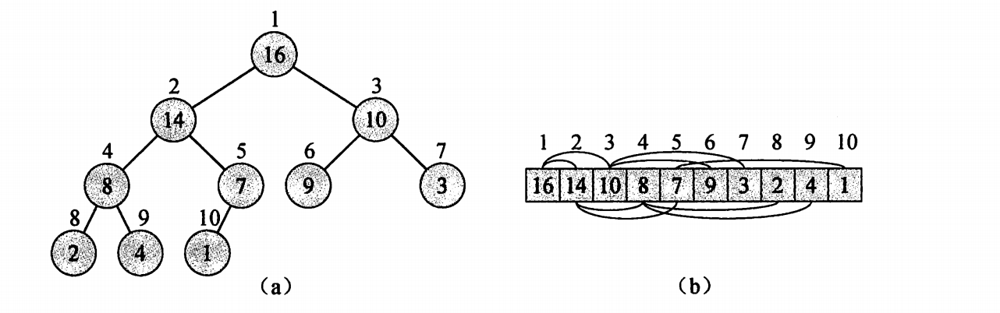

# 排序
[215. 数组中的第K个最大元素](https://leetcode-cn.com/problems/kth-largest-element-in-an-array/)

[347. 前 K 个高频元素](https://leetcode-cn.com/problems/top-k-frequent-elements/)
## 快排：
快排思路：
1.利用partition函数在数组中找到一个mid下标，通过移动元素，使得mid左边的元素都比mid小，右边的都比mid大。

2.递归对mid左边和右边的元素进行快速排序

3.不断进行下去，区间会越来越小，函数如果start==end说明区间只有一个元素，也就不用排序，这就是终止条件。

快排其实是有很多版本的，最开始的是霍尔的版本，是一个递归的版本。下面代码基于霍尔版本，在patition的问题上做了点改进，可以算比较纯正的快排了，如果在patition的选择上加入随机，就是随机快排，理论上这种快排速度最快。

快速排序的副产品就是快速选择算法，因为partition函数实际上返回的mid值就是array[mid]在已经排序的array里面所处的顺位，所以我们在学习快速排序的时候可以顺便把Top k也学了。
```python
'''
1.24 从小到大快排
    write by haoMax
'''
def partition(arr,left,right):
    povit=arr[right]
    i=left-1
    for j in range(left,right):
        if povit>arr[j]:
            i+=1
            arr[i],arr[j]=arr[j],arr[i]
    arr[i+1],arr[right]=arr[right],arr[i+1]
    return i+1       
def quicksort(arr,left,right):
    if left<right:
        q=partition(arr,left,right)
        quicksort(arr,q+1,right)
        quicksort(arr,left,q-1)
    return arr
arr=[6, 12, 27, 34, 21, 4, 9, 8, 11, 54, 3, 7, 39] 
print(quicksort(arr,0,len(arr)-1))
```

通过随机化partition的选择，我们可以将期望复杂度降到最低：
```python
import random
def partition(arr,left,right):
    povit=arr[right]
    i=left-1
    for j in range(left,right):
        if povit>arr[j]:
            i+=1
            arr[i],arr[j]=arr[j],arr[i]
    arr[i+1],arr[right]=arr[right],arr[i+1]
    return i+1
def randomized_partition(a,p,r):
    i=random.randint(p,r)
    a[i],a[r]=a[r],a[i]
    return partition(a,p,r)       
def quicksort(arr,left,right):
    if left<right:
        q=randomized_partition(arr,left,right)
        quicksort(arr,q+1,right)
        quicksort(arr,left,q-1)
    return arr
arr=[6, 12, 27, 34, 21, 4, 9, 8, 11, 54, 39, 7, 3] 
print(quicksort(arr,0,len(arr)-1))
```

我们只要添加几行代码就可以把快排改成快速选择算法
```python
def partition(arr,left,right):
    povit=arr[right]
    i=left-1
    for j in range(left,right):
        if povit>arr[j]:
            i+=1
            arr[i],arr[j]=arr[j],arr[i]
    arr[i+1],arr[right]=arr[right],arr[i+1]
    return i+1       
def quicksort(arr,left,right,k):
    if not left<right:return False
    q=partition(arr,left,right)
    flag1=quicksort(arr,left,q-1,k)
    if flag1:
        return flag1
    if q==k-1:
        return arr[q]
    flag2=quicksort(arr,q+1,right,k)
    if flag2:
        return flag2
    return arr[k-1]
arr=[6, 12, 27, 34, 21, 4, 9, 8, 11, 54, 39, 7, 3] 
k=6
print(quicksort(arr,0,len(arr)-1,k))
```

当然我们知道，一切递归算法都可以用模拟栈的方法来改成非递归代码，下面是改进的非递归快排序：
```python
def partition(arr,left,right):
    povit=arr[right]
    i=left-1
    for j in range(left,right):
        if povit>arr[j]:
            i+=1
            arr[i],arr[j]=arr[j],arr[i]
    arr[i+1],arr[right]=arr[right],arr[i+1]
    return i+1       
def quicksort(arr,left,right):
    if len(arr) < 2:
        return arr
    stack = []
    stack.append(right)
    stack.append(left)
    while stack:
        l = stack.pop()
        r = stack.pop()
        index = partition(arr, l, r)
        if l < index - 1:
            stack.append(index - 1)
            stack.append(l)
        if r > index + 1:
            stack.append(r)
            stack.append(index + 1)
    return arr
arr=[6, 12, 27, 34, 21, 4, 9, 8, 11, 54, 39, 7, 3] 
k=6
print(quicksort(arr,0,len(arr)-1))

```
（不推荐）当然我们也可以不实现找partition这个函数，直接两块合到一起，问题是就不能顺便求patition了。优点是代码简单多了，思想还是一样的。
```python
def quick_sort(lists,i,j):#i左，j右
    if i >= j:
        return lists
    pivot = lists[i]
    low = i
    high = j
    while i < j:
        while i < j and lists[j] >= pivot:
            j -= 1
        lists[i]=lists[j]
        while i < j and lists[i] <=pivot:
            i += 1
        lists[j]=lists[i]
    lists[j] = pivot
    quick_sort(lists,low,i-1)
    quick_sort(lists,i+1,high)
    return lists

if __name__=="__main__":
    lists=[2,4,6,8,3,11,20,15]
    print("排序前的序列为：")
    for i in lists:
        print(i,end =" ")
    print("\n排序后的序列为：")
    for i in quick_sort(lists,0,len(lists)-1):
        print(i,end=" ")
```

## 堆排：
堆：
数据结构里面的堆指的是一种完全二叉树结构，这和操作系统内存中的堆是不同的。从堆的底层结构来讲既可以是数组，也可以是树结构，针对排序问题中的堆结构，二者是可以相互转换的，转换关系从下图可以看出来：



由于是完全二叉树，父节点和子节点存在某种关系，即父节点为i，i\*2+1为左节点，i\*2+2为右节点。

排序：
堆排的原理和[动图](https://www.runoob.com/w3cnote/heap-sort.html)。从代码的角度讲，我们将堆排的过程分成两部分，第一部分是自下而上调整堆，找出最小（大）的数。第二部分是将最小（大）的数和最后一个数进行交换，确定了最后一个数之后重新自上而下调整堆。
```python
#调整的方法很简单，找到最底层的父节点，交换成最小（大），然后自底向上不断调整。
def HeapAdjust(lst,k,n):
    while(2*k+1<n):#第一步是找到当前最小的父节点k，如果k的子节点还是父节点且需要调整也需要调整子节点的顺序。这里要和break配合的
        j=2*k+1
        if j+1<n and lst[j]>lst[j+1]:#注意这里的j+1<n不仅仅因为保护数组不越界，而且在自上而下调整的时候保证了j+1不会超过排好的序列
            j=j+1           #j是左右节点中较大（小）的
        if lst[j]<lst[k]:
            temp=lst[k]
            lst[k]=lst[j]
            lst[j]=temp
            k=j
        else:
            break
    return lst

def HeapSort(lst):
    n=len(lst)
    for i in range(int(n/2)-1,-1,-1):
        lst=HeapAdjust(lst,i,n)#对于第一部分而言最需要记忆的是两种调整的参数的区别，第一个从下到上需要输入节点，和长度n
    for i in range(n-1,0,-1):
        lst[0],lst[i]=lst[i],lst[0]
        lst=HeapAdjust(lst,0,i)#第二个输入根节点0，长度i其实是变化的
    return lst
a=[1,5,2,8,3,4,6,9,7]
result=HeapSort(a)
print(result)
```


堆topk:

```python
def HeapAdjust(lst,k,n):
    while(2*k+1<n):
        j=2*k+1
        if j+1<n and lst[j]>lst[j+1]:
            j=j+1
        if lst[j]<lst[k]:
            temp=lst[k]
            lst[k]=lst[j]
            lst[j]=temp
            k=j
        else:
            break
    return lst
def HeapSort(lst,k):
    n=len(lst)
    for i in range(int(n/2)-1,-1,-1):
        lst=HeapAdjust(lst,i,n)
    for i in range(n-1,0,-1):
        temp=lst[0]
        if n-i==k:
            return temp
        lst[0]=lst[i]
        lst[i]=temp
        lst=HeapAdjust(lst,0,i)
    return False
a=[ 12, 11, 13, 5, 6, 7]
k=2
print(HeapSort(a,k))
```