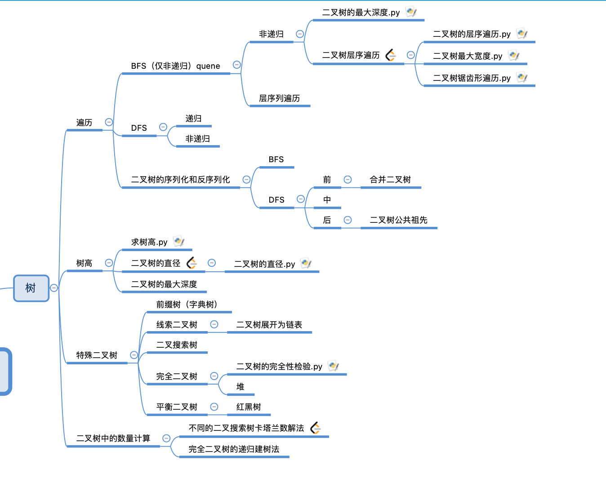
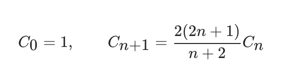

# 树
树的题主要是由三部分组成。第一类是由树的遍历问题引起，第二类是由求树高引申而来，当然求树高本身和DFS（树的深度遍历）有关，第三类就是一些特殊的二叉树。树的题目可能会涉及到递归，栈（stack），队列（quene）。在此过程中，理解树的遍历是一切的基础。同时，我们需要明白树中的一些计算关系，比如完全二叉树父子节点关系，卡塔兰数等。整体结构如图:



## 一.遍历
可以说树的遍历，是所有树相关题目的基础。从遍历方式的角度看，分为广度优先遍历和深度优先遍历。其中广度优先只有非递归形式，而深度遍历包含递归和非递归形式。

### 1.深度优先遍历

理解树的DFS递归和非递归方式是很重要的，这是一个经典的案例。帮助我们理解递归的本质，是利用系统栈进行嵌套调用，我们完全可以自己来写这个栈（非递归写法）来替代系统栈的作用。

#### 1.1 递归DFS

递归遍历，根据读取根节点的顺序可以分为前序，中序和后序。
```python
#前序遍历
def printfDfs(root):
    if not root: return
    #前序遍历节点操作
    print(root.val)
    printfDfs(root.right)
    printfDfs(root.left)
#中序遍历
def printfDfs(root):
    if not root: return
    printfDfs(root.right)
    #中序遍历节点操作
    print(root.val)
    printfDfs(root.left)
#后序遍历
def printfDfs(root):
    if not root: return
    printfDfs(root.right)
    printfDfs(root.left)
    #后序遍历节点操作
    print(root.val)
```
从上面DFS递归遍历我们可以发现前中后遍历的区别仅仅是节点操作的位置不同而已。
#### 1.1.1 遍历例题：
[合并二叉树](https://leetcode-cn.com/problems/merge-two-binary-trees/)

```python
class Solution:
    def mergeTrees(self, root1: TreeNode, root2: TreeNode) -> TreeNode:
        if not root1:return root2
        if not root2:return root1
        mergeNode=TreeNode(root1.val+root2.val)
        mergeNode.left=self.mergeTrees(root1.left,root2.left)
        mergeNode.right=self.mergeTrees(root1.right,root2.right)
        return mergeNode
```
[105. 从前序与中序遍历序列构造二叉树](https://leetcode-cn.com/problems/construct-binary-tree-from-preorder-and-inorder-traversal/)

```python
from Tree import TreeNode,TreeNodeTools
class Solution(object):
	def buildTree(self, preorder, inorder):
		if not (preorder and inorder):
			return None
		# 根据前序数组的第一个元素，就可以确定根节点	
		root = TreeNode(preorder[0])
		# 用preorder[0]去中序数组中查找对应的元素
		mid_idx = inorder.index(preorder[0])
		# 递归的处理前序数组的左边部分和中序数组的左边部分
		# 递归处理前序数组右边部分和中序数组右边部分
		root.left = self.buildTree(preorder[1:mid_idx+1],inorder[:mid_idx])
		root.right = self.buildTree(preorder[mid_idx+1:],inorder[mid_idx+1:])
		return root
ss=Solution()
print(ss.buildTree([1,2,4,5,3,6,7],[4,2,5,1,6,3,7]))
```

但是值得注意的是前中后看似仅仅是遍历顺序的不同，但有时充分利用这种不同，可以完成一些非常不同的功能。比如下面的例题：

#### 1.1.2 必须后续遍历：[二叉树的最近公共祖先](https://leetcode-cn.com/problems/lowest-common-ancestor-of-a-binary-tree/)

```python
def lowestCommonAncestor(root,p,q):
    if root==None:return None
    if root==p or root==q:
        return root
    left=lowestCommonAncestor(root.left,p,q)
    right=lowestCommonAncestor(root.right,p,q)
    #两个都有，根据后续遍历的特点root就是两个的前一个节点
    if left!=None and right!=None:
        return root
    #两个都不存在返回none
    if left==None and right==None:
        return None
    #一个存在一个不存在说明存在的那个是公共祖先
    return right if left==None else left
import Tree
ss=Tree.TreeNodeTools()
root=ss.createTreeByrow([3,5,1,6,2,0,8,'null','null',7,4],0)
t5=root.left
t4=root.left.right.right
t1=root.right
print(lowestCommonAncestor(root,t5,t4).val)
```

#### 必须前序遍历: 1.1.3 [226. 翻转二叉树](https://leetcode-cn.com/problems/invert-binary-tree/)[Liu]

```python
class Solution:
    def invertTree(self, root: TreeNode) -> TreeNode:
        if not root:return None
        root.left,root.right=root.right,root.left
        self.invertTree(root.left)
        self.invertTree(root.right)
        return root
```
#### 必须中序遍历：1.1.4 [538. 把二叉搜索树转换为累加树](https://leetcode-cn.com/problems/convert-bst-to-greater-tree/)[Liu]

```python
class Solution:
    def convertBST(self, root: TreeNode) -> TreeNode:
        pre=0
        def dfs(root):
            nonlocal pre
            if not root:return
            dfs(root.right)
            root.val=root.val+pre
            pre=root.val
            dfs(root.left)
            return root
        return dfs(root)
```

接下来三道例题展示了dfs解题的一个难点，也是写递归的最大的难点：如何设计判断return

[101. 对称二叉树](https://leetcode-cn.com/problems/symmetric-tree/)[Liu]
虽然一看就是dfs,在进行递归判断的时候还是要花点功夫的。
```python
from Tree import TreeNode,TreeNodeTools
class Solution:
    def isSymmetric(self, root: TreeNode) -> bool:
        if not root:return True
        def dfs(right,left):
            if not right and not left:#这个代表遍历到底了
                return True
            if not right or not left:#这个代表其中一个树为空节点
                return False
            if right.val!=left.val:#这个代表两个对应节点的值不一样
                return False
            return dfs(left.right,right.left) and dfs(left.left,right.right)
        return dfs(root.right,root.left)

tools=TreeNodeTools()
root=tools.createTreeByrow("[1,2,2,2,null,2,null,null,null,null,null]")#这个就是典型的问题，后面null没有补全
ss=Solution()
print(ss.isSymmetric(root))
```

[98. 验证二叉搜索树](https://leetcode-cn.com/problems/validate-binary-search-tree/)[Liu]
一看就dfs中序遍历，遍历的顺序是左根右，我们需要记录当前节点的前一个节点，只要保证前一个节点的值大于当前节点就是二叉树。
```python
from Tree import TreeNode,TreeNodeTools
class Solution:
    def isValidBST(self, root: TreeNode) -> bool:
        pre=-float("inf")
        def dfs(root):
            nonlocal pre
            if not root:return True
            if not dfs(root.left):
                return False
            if root.val<=pre:
                return False
            pre=root.val
            return dfs(root.right)
        return dfs(root)
ss=Solution()
tools=TreeNodeTools()
root3=tools.createTreeByrow("[5,1,7,null,null,6,9,null,null,null,null]")
print(ss.isValidBST(root3))
```
[437. 路径总和 III](https://leetcode-cn.com/problems/path-sum-iii/)
双递归dfs
```python
from Tree import TreeNode,TreeNodeTools

class Solution:
    def __init__(self):
        self.ans=0
    def helper(self,node,curr):
        if not node:
            return 
        if node.val==curr:
            self.ans+=1

        self.helper(node.left,curr-node.val)
        self.helper(node.right,curr-node.val)

    def pathSum(self, root: TreeNode, sum: int) -> int:
        if not root:
            return 0
        self.helper(root,sum)
        self.pathSum(root.left,sum)
        self.pathSum(root.right,sum)

        return self.ans
ss=Solution()
root=TreeNodeTools().createTreeByrow('[1,-2,3,1,3,-2,null,-1,null,null,null,null,null,null,null]')
print(ss.pathSum(root,-1))
```
#### 1.2 非递归DFS
我们将利用系统栈的递归写法改成利用自己写栈的顺序写法。
```python

#非递归前序遍历
def printfDfs(root):
    if not root:return []
    stack=[]
    stack.append(root)
    res=[]
    while len(stack)>0:
        temp=[]
        for i in range(len(stack)):
            node=stack.pop()#改成直接pop
            temp.append(node.val)
            if node.left:
                stack.append(node.left)
            if node.right:
                stack.append(node.right)
        res.append(temp[:])
    return res
#非递归中序遍历(通过操作栈先将左节点压入栈直到左节点为空，出栈顶元素，打印，当没有左结点时，将当前节点的右孩子赋值给_root，依次循环)
from Tree import TreeNode,TreeNodeTools
def dfs_middle(root):
    if not root:return
    stack=[]
    while stack or root:
        while root:
            stack.append(root)
            root=root.left
        if stack:
            data=stack.pop()
            root=data.right
            print(data.val)
ss=TreeNodeTools()
root3=ss.createTreeByrow("[1,2,3,null,null,4,5,null,null,null,null]")
dfs_middle(root3)

#非递归后序遍历（双栈法）
# 后序只要将前序用另一个栈记录下来，输出就行
from Tree import TreeNode,TreeNodeTools
def dfs_last(root):
    if not root:return
    stack1=[]
    stack2=[]
    stack1.append(root)
    while stack1:
        node=stack1.pop()
        if node.left:
            stack1.append(node.left)
        if node.right:
            stack1.append(node.right)
        stack2.append(node)
    while stack2:
        data=stack2.pop()
        print(data.val)
ss=TreeNodeTools()
root3=ss.createTreeByrow("[1,2,3,null,null,4,5,null,null,null,null]")
dfs_last(root3)
```

### 2. 广度优先遍历(BFS)
首先我们先看到将非递归DFS中的stack结构替换成quene(队列)结构我们就可以实现BFS。
```python
import Tree
ss=Tree.TreeNodeTools()
root=ss.createTreeByrow([1,2,3,4,5,6,7],0)
# ss.printf(root3)
class Solution:
    def levelOrder(self, root):
        if not root:return []
        quene=[]
        quene.append(root)
        res=[]
        while len(quene)>0:
            node=quene.pop(0)
            res.append(node.val)
            if node.left:
                quene.append(node.left)
            if node.right:
                quene.append(node.right)
        return res
ss=Solution()
print(ss.levelOrder(root))
```
我们可以理解一下为什么广度优先遍历不存在递归写法，而深度优先存在？理由就是进程中存在系统栈而不存在系统队列这种结构，函数调用利用的是栈，所以我们可以利用系统栈实现递归调用。而在广度优先遍历这种需要用到队列的问题中，递归就无能为力了。

### 3. 层序遍历
接着我们来看层序遍历，我们要区分开BFS和层序遍历的区别。层序遍历是将每一层的结果单独放置在一个list中的，比如说广度优先的树是[1,2,3,4,5],那么层序遍历的输出就是[[1],[2,3],[4,5]]。同时这也是leetcode上的一道题目。

#### [102. 二叉树的层序遍历](https://leetcode-cn.com/problems/binary-tree-level-order-traversal/)

层序遍历是在广度优先的基础上改的，利用list的特性我们来改造广度优先为层序遍历：
```python
import Tree
ss=Tree.TreeNodeTools()
root=ss.createTreeByrow([1,2,3,4,5,6,7],0)
class Solution:
    def levelOrder(self, root):
        if not root:return []
        stack=[]
        stack.append(root)
        res=[]
        while len(stack)>0:
            temp=[]
            for i in range(len(stack)):
                node=stack.pop(0)
                temp.append(node.val)
                if node.left:
                    stack.append(node.left)
                if node.right:
                    stack.append(node.right)
            res.append(temp[:])
        return res
ss=Solution()
print(ss.levelOrder(root))
```
事实上我们看待我们仅仅在层序遍历的基础上多添加了一个循环，就起到了神奇的效果。
注意：本题中“for i in range(len(stack)):”这一行采用了range函数，如果采用“for i in stack:”这个方法结果就不一样了。前者"[[1], [2, 3], [4, 5]]",后者"[[1, 2, 3], [4, 5]",原因是python中list具有全局特性，后面append会影响for循环。
而采用range之后仅仅记录了一个临时变量，不会因为append而改变。


### 4. 二叉树的建立和对应的遍历
在面试过程中二叉树，我们往往需要先手写建立二叉树，然后才能验证我们写的算法正确性。所以学会二叉树的建立是很重要的，二叉树的遍历分为深度优先遍历（DFS）和广度优先遍历。通过二叉树的序列化和反序列化，我们可以学习典型的二叉树建立方式。

#### [297. 二叉树的序列化与反序列化](https://leetcode-cn.com/problems/serialize-and-deserialize-binary-tree/)
下面我们分别采用BFS和DFS的三种方式来序列化和反序列化二叉树。

4.1 广度优先遍历：

在这个说明问题之前，我们要先注意两个问题
问题一：leetcode通常采用层序遍历来表达二叉树，字符串和二叉树结构的对应关系与官方文档上并不一致
[二叉树测试用例意义官方解释](https://support.leetcode-cn.com/hc/kb/article/1194353/)
事实上输入用例是遍历到最后一个None的位置的，比如：
```
      5
     / \
    4   7
   /   /
  3   2
 /   /
-1  9
```
对应的list应该是：[5,4,7,3,null,2,null,-1,null,9,null,null,null,null,null]也就是：
```
         5
        / \
       4   7
      /   /
     3   2
    /   / 
   -1  9 ----中间也有null不写出来了
  / \ / \
null null null null-----到这层为止
```

问题二：在序列化的过程中输入的是一个树的root节点，输出的是一个字符串。在反序列过程中，输入的是字符串输出的是root节点。


明确这两个问题之后，我们先进行广度优先遍历序列化操作。我们知道广度遍历要用到队列，所以只有非递归的写法。
```python
#显然序列化操作本质上就是一个采用quene的广度优先遍历操作，区别是我们需要把null也记录下来，记录下来后的结构依照问题一。并注意最后转化成字符串。
    def serialize(self, root):
        if not root: return "[]"
        queue = []
        queue.append(root)
        res = []
        while queue:
            node = queue.pop(0)
            if node:
                res.append(str(node.val))
                queue.append(node.left)
                queue.append(node.right)
            else: res.append("null")
        return '[' + ','.join(res) + ']'
      
```
反序列化：
反序列化也利用了队列的结构。
```python
    def deserialize(self,data):
        if data=='[]':
            return None
        vals, i = data[1:-1].split(','), 1
        root = TreeNode(int(vals[0]))
        queue = []
        queue.append(root)
        while queue:
            node = queue.pop(0)
            if vals[i] != "null":
                node.left = TreeNode(int(vals[i]))
                queue.append(node.left)
            i += 1
            if vals[i] != "null":
                node.right = TreeNode(int(vals[i]))
                queue.append(node.right)
            i += 1
        return root
```
完整代码：
```python
class TreeNode:
    def __init__(self,x=0):
        self.val=x
        self.left=None
        self.right=None
class Codec:
    def serialize(self, root):
        if not root: return "[]"
        queue = []
        queue.append(root)
        res = []
        while queue:
            node = queue.pop(0)
            if node:
                res.append(str(node.val))
                queue.append(node.left)
                queue.append(node.right)
            else: res.append("null")
        return '[' + ','.join(res) + ']'

    def deserialize(self, data):
        if data=='[]':
            return None
        vals, i = data[1:-1].split(','), 1
        root = TreeNode(int(vals[0]))
        queue = []
        queue.append(root)
        while queue:
            node = queue.pop(0)
            if vals[i] != "null":
                node.left = TreeNode(int(vals[i]))
                queue.append(node.left)
            i += 1
            if vals[i] != "null":
                node.right = TreeNode(int(vals[i]))
                queue.append(node.right)
            i += 1
        return root
ser = Codec()
deser = Codec()
root=deser.deserialize("[1,2,3,null,null,4,5,null,null,null,null]")
ans=ser.serialize(root)
print(ans)
print(deser.deserialize(ans))
```
同时我们要注意，只有完全二叉树具有反序列化的递归写法。想想是为什么？其实完全二叉树具有递归的形式，而普通二叉树并不是递归的。

4.2 深度优先遍历（待有空更新）

4.2.1 前序建树及对应的遍历
```python

```

4.2.2 中序建树及对应的遍历
```python

```

4.2.3 后序建树及对应的遍历
```python

```

## 二.树高
### 2.1 求树高
我们通常利用DFS的递归遍历方式求解树高。之所以把求树高的问题单独列出来，而不是归类到DFS中，是因为求树高的过程有一些颇难理解的地方，涉及到递归过程的返回值问题。比如下面这个求树高的典型代码：

```python
def deeptree(root):
    if not root:return 0
    left=deeptree(root.left)
    right=deeptree(root.right)
    return max(left,right)+1
```


上图展示了二叉树递归求高的前3个递归结果，可以看出在叶子节点为空的时候left,right接受return 0的返回值，而在非叶子节点接受max(left,right)+1的会返回值。

### 2.2 经典例题
[104. 二叉树的最大深度](https://leetcode-cn.com/problems/maximum-depth-of-binary-tree/)

[543. 二叉树的直径](https://leetcode-cn.com/problems/diameter-of-binary-tree/)[Liu]

[124. 二叉树中的最大路径和](https://leetcode-cn.com/problems/binary-tree-maximum-path-sum/)[Liu]
题解见./hot100


## 三.特殊二叉树
特殊的二叉树结构同样是考察的重点。这些树难度要求不一，比如前缀树如果没有做过是极难想到的；又比如红黑树我们必须了解其前世今生，但对实现不必苛求。

### 3.1 前缀树
前缀树是一种利用字典结构实现的多叉树，它跟其他树（n叉树,n>1）在数据结构层面有本质上的区别。

[208. 实现 Trie (前缀树)](https://leetcode-cn.com/problems/implement-trie-prefix-tree/)

```python
class Trie:
    def __init__(self):
        """
        Initialize your data structure here.
        """
        self.lookup = {}
        
    def insert(self, word: str) -> None:
        """
        Inserts a word into the trie.
        """
        tree = self.lookup
        for a in word:
            if a not in tree:
                tree[a] = {}
            tree = tree[a]
        # 单词结束标志
        tree["#"] = "#"
        

    def search(self, word: str) -> bool:
        """
        Returns if the word is in the trie.
        """
        tree = self.lookup
        for a in word:
            if a not in tree:
                return False
            tree = tree[a]
        if "#" in tree:
            return True
        return False
        

    def startsWith(self, prefix: str) -> bool:
        """
        Returns if there is any word in the trie that starts with the given prefix.
        """
        tree = self.lookup
        for a in prefix:
            if a not in tree:
                return False
            tree = tree[a]
        return True
trie=Trie()
trie.insert("apple")
trie.insert("appue")
print(trie.startsWith("appu"))
```
用到了前缀树的题目：

[211. 添加与搜索单词 - 数据结构设计](https://leetcode-cn.com/problems/design-add-and-search-words-data-structure/)

[212. 单词搜索 II](https://leetcode-cn.com/problems/word-search-ii/)
这道题太有意思了，整合了trie树和backtracking中[单词搜索](https://leetcode-cn.com/problems/word-search/)的核心思想。但是由于本题是同时搜索多个单词，在return的选择上会有不同的变化，我们并不需要返回true还是flase了，但我们要明白不论return false还是true本质上都会终端当前的递归返回上一层。
```python
class Solution:
    def findWords(self, board: List[List[str]], words: List[str]) -> List[str]:
        root={}
        w=len(board)
        h=len(board[0])
        res=[]
        for word in words:
            p=root
            for i in word:
                if i not in p:
                    p[i]={}
                p=p[i]
            p['#']=word
        def dfs(start,root):
            i,t=start[0],start[1]
            if '#' in root:
                res.append(root['#'])
                root.pop('#')
            if i<0 or i>=w or t<0 or t>=h or board[i][t] not in root:
                return False
            board[i][t],temp='/',board[i][t]
            dfs((i+1,t),root[temp]) or dfs((i,t+1),root[temp]) or dfs((i-1,t),root[temp]) or dfs((i,t-1),root[temp])
            board[i][t]=temp

        for t in range(len(board)):
            for u in range(len(board[0])):
                if board[t][u] in root:
                    dfs((t,u),root)
        return res
#本题有几个容易错的case:
#1.
# [["o","a","a","n"],["e","t","a","e"],["i","h","k","r"],["i","f","l","v"]]
# ["oath","pea","eat","rain","hklf", "hf"] 这个case的关键在于hklf,hf的同前缀的处理
#2.
 # [["o","a","b","n"],["o","t","a","e"],["a","h","k","r"],["a","f","l","v"]]
#["oa","oaa"]
#3.
# [["o","a","a","n"],["e","t","a","e"],["i","h","k","r"],["i","f","l","v"]]
# ["oath","pea","eat","rain","oathi","oathk","oathf","oate","oathii","oathfi","oathfii"]
```


[421. 数组中两个数的最大异或值](https://leetcode-cn.com/problems/maximum-xor-of-two-numbers-in-an-array/)
解决这个问题，我们首先需要利用异或运算的一个性质：
```
如果 a ^ b = c 成立，那么a ^ c = b 与 b ^ c = a 均成立。[图解](https://leetcode-cn.com/problems/maximum-xor-of-two-numbers-in-an-array/solution/li-yong-yi-huo-yun-suan-de-xing-zhi-tan-xin-suan-f/)
```

### 3.2 线索二叉树
建立线索二叉树，或者说对二叉树线索化，实质上就是遍历一棵二叉树。在遍历过程中，访问结点的操作是检查当前的左，右指针域是否为空，将它们改为指向前驱结点或后续结点的线索。这个树主要是用在这题上：

[114. 二叉树展开为链表](https://leetcode-cn.com/problems/flatten-binary-tree-to-linked-list/)

我们可以看一下二叉树线索化的代码：
```python
class Solution:
    def flatten(self, root: TreeNode) -> None:
        curr = root
        while curr:
            if curr.left: #存在左结点,即右结点存在前驱
                pre = nxt = curr.left
                #寻找前驱结点，在左子树的最右边(最后)
                while pre.right:
                    pre = pre.right
                pre.right = curr.right #右结点与前驱结点连接
                curr.left = None
                curr.right = nxt
            curr = curr.right
```

### 3.3 完全二叉树
完全二叉树最大的特点是:父节点root和左右子节点具有索引下标的联系，因此任意一个线性结构均可看作是完全二叉树。而如果这个完全二叉树满足子节点均小于（大于）父节点，那么这棵二叉树就是大根堆（小根堆）。所以完全二叉树的题多以堆的形式考察。此处放一题：

[958. 二叉树的完全性检验](https://leetcode-cn.com/problems/check-completeness-of-a-binary-tree/)

```python
class Solution:
    def isCompleteTree(self, root: TreeNode) -> bool:
        quene=[]
        quene.append((root,1))
        temp=[1]
        while len(quene)>0:
            for i in range(len(quene)):
                node,po=quene.pop(0)
                temp.append(po)
                if node.left:
                    quene.append((node.left,2*po))
                if node.right:
                    quene.append((node.right,2*po+1))
        for i in range(len(temp)-1):
            if temp[i+1]-temp[i]>1:
                return False
        return True
```
从答案可以看出使用层序遍历的方式进行修改而来。

### 3.4 搜索二叉树
另一个比较常用的特殊二叉树是搜索二叉树。
[96. 不同的二叉搜索树](https://leetcode-cn.com/problems/unique-binary-search-trees/)
什么是二叉搜索树？
二叉搜索树是一种节点值之间具有一定数量级次序的二叉树，对于树中每个节点：
若其左子树存在，则其左子树中每个节点的值都不大于该节点值；
若其右子树存在，则其右子树中每个节点的值都不小于该节点值。
我们可以想想【1，2，3，4，5】这样一个数组有几种可能性。我们只需要分别以数组中的数作为根节点，然后将左右分别组成搜索二叉树即可，所以整个程序是一个递归的程序。
题解见./hot100
本题有还有卡塔兰数解法。
进阶题是：

[不同的二叉搜索树 II](https://leetcode-cn.com/problems/unique-binary-search-trees-ii/)

卡塔兰数的递推公式：



卡塔兰数的前几项：[1, 1, 2, 5, 14, 42, 132, 429, 1430, 4862]
括号生成数量 就是典型的卡塔兰数

### 3.5 平衡二叉树
平衡二叉树的调整是面试常考的问题，而由此衍生的红黑树属于面试必问问题，我至今没有经历过一家公司的面试不问红黑树的，只是问的深浅问题。

#### 3.5.1 红黑树
红黑树本质上是一种自平衡二叉查找树，红黑树的应用比较广泛，主要是用它来存储有序的数据，它的时间复杂度是O(lgn)，效率非常之高。
例如，Java集合中的TreeSet和TreeMap，C++ STL中的set、map，以及Linux虚拟内存的管理，都是通过红黑树去实现的。

### 3.6 B树和B+树

b树：（1）多路查找树，非二叉树
（2）每个节点既保存索引，又保存数据
（3）搜索时相当于二分查找
b+树：（1）多路查找树，非二叉
（2）只有叶子节点保存数据
（3）搜索时相当于二分查找
（4）增加了相邻接点的指向指针。b+树可以查范围
非关系型用b树，速度快。关系型用b+，范围查找

## 本节待研究
其实每个领域要完全研究透，需要大量的时间和精力。受限于此，本人认为先浅后反复加深更有助于掌握。现将几个还没完全研究透的问题先记录下来：
1.catalan数与汉诺塔、括号生成等问题具有某种数学上的联系
2.红黑树效率很高，这是怎么做到的（算法导论有大量的讨论）
3.b数和b+的在存储结构上有很深的应用，怎么做到的
4.序列化和反序列化，除了层序遍历之外的做法