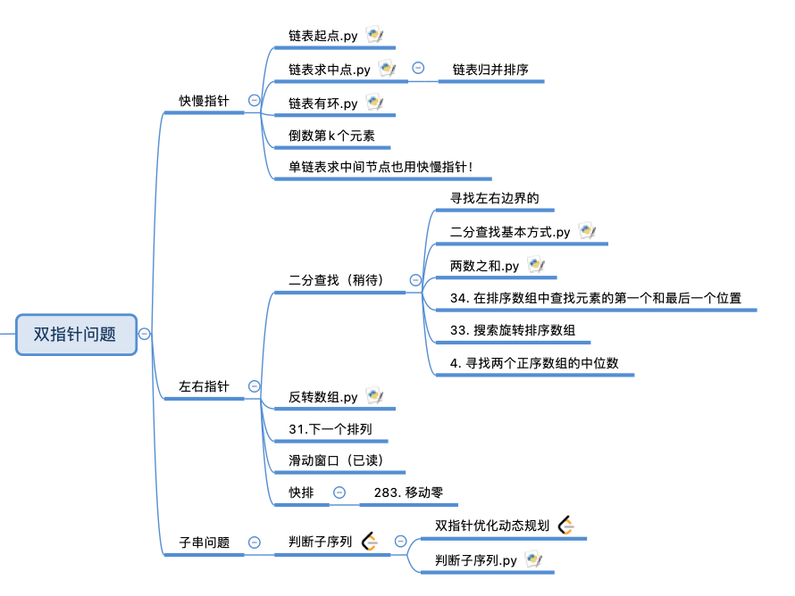

# 双指针问题



双指针问题就是一系列利用两个指针操作可以解出来的问题。既然是两个指针我们可以想想有哪些变换的空间，无非是从不同的位置出发是一种；从同一个位置出发，但是速度不一样；干脆用两个指针遍历两个不同的可迭代序列。因此我们可以将双指针问题分为三类，左右指针，快慢指针，子串问题。

## 一.左右指针
左右指针顾名思义，就是一个左指针指向一个右指针。如果一个指针在头部，另一个在尾部，这样的形式有什么用呢？我们第一个想到的就是二分查找。另外如果把两个指针组成一个窗口，那就成了滑动窗口题了。最后一个也是利用一个指针在头部，另一个在尾部，但是还要加上递归，就成了快排问题。

### 1.1 二分查找
不同于排序算法有多种，查找算法一般就是二分查找，二叉树查找（二叉树的遍历）。如果把更宽泛意义上的，比如查找字符串算上，那就有回溯算法，滑窗这两个。如果说要求log复杂度，一般就是二分没跑了。

1.1.1 二分的原始写法
二分问题最大的难点在于边界问题
```python
def leftbinaysearch(nums,target):
        left=0
        right=len(nums)-1
        while left<=right: #注意点一：<= 原因是[0] 0 如果不是==就直接返回-1了
                mid=left+(right-left)//2
                if nums[mid]<target:
                        left=mid+1
                elif nums[mid]>target:
                        right=mid-1
                elif nums[mid]==target:#注意点二：三个判断条件都是互斥的
                         return mid
        return -1
num=[1,2,3,9,10,45]
print(binaySearch(num,45))
```

1.1.2 寻找左右边界
考虑左右边界会比较绕，if 条件有两个要注意。
```python
def leftbinaysearch(nums,target):
        left=0
        right=len(nums)-1
        while left<=right:
                mid=left+(right-left)//2
                if nums[mid]<target:
                        left=mid+1
                elif nums[mid]>target:
                        right=mid-1
                elif nums[mid]==target:
                        left=mid+1
        # if left>=len(nums) or nums[left]!=target:
        #         return -1
        if right<0 or nums[right]!=target:
                return -1
        return right

def leftbinaysearch(nums,target):
        left=0
        right=len(nums)-1
        while left<=right:
                mid=left+(right-left)//2
                if nums[mid]<target:
                        left=mid+1
                elif nums[mid]>target:
                        right=mid-1
                elif nums[mid]==target:
                        right=mid-1
        if left>=len(nums) or nums[left]!=target:
                return -1
        return left
```
1.1.3 衍生题
二分查找的通用性导致基于这种题的衍生题特别的多
[34. 在排序数组中查找元素的第一个和最后一个位置](https://leetcode-cn.com/problems/find-first-and-last-position-of-element-in-sorted-array/)

这是一个二分查找的问题，二分查找最需要注意的是边界问题。既可以通过上面左右边界改，也可以直接找到之后进行左右嗅探。
```python
class Solution:
    def searchRange(self, nums: List[int], target: int) -> List[int]:
        left=0
        right=len(nums)-1
        while left<=right:
            mid=left+(right-left)//2
            if nums[mid]<target:
                left=mid+1
            elif nums[mid]>target:
                right=mid-1
            elif nums[mid]==target:
                res=[mid,mid]
                temp=mid-1
                while temp>=0 and nums[temp]==target:
                    res[0]=temp
                    temp-=1
                temp=mid+1
                while temp<len(nums) and nums[temp]==target:
                    res[1]=temp
                    temp+=1
                return res
        return [-1,-1]
```
比如 left<=right，这个地方必须是<=，比如[1],1这个案例如果<就不能进入循环了。同时本题也可以采用左右边界写法，那样子写的话要分别实现左右边界函数。

[33. 搜索旋转排序数组](https://leetcode-cn.com/problems/search-in-rotated-sorted-array/)
一个比较绕二分查找的题目，要注意边界条件。同时注意题目中说了不含重复元素，个人感觉这是一个不是很必要的的条件。
```python
class Solution:
    def search(self, nums, target: int) -> int:
        left=0
        right=len(nums)-1
        while left<=right:
            mid=left+(right-left)//2
            #判断左边一半是有序的
            if nums[mid]==target:
                return mid
            if nums[mid]>=nums[0]:#这里等号[1,1,1,1,1,3]
                if nums[0]<=target<nums[mid]:
                    right=mid-1
                else:
                    left=mid+1
            #右边部分是有序的
            else:
                if nums[mid]<target<=nums[len(nums)-1]:#【1，3】1
                    left=mid+1
                else:
                    right=mid-1
        return -1
ss=Solution()
print(ss.search([3,1],1))
```
[4. 寻找两个正序数组的中位数](https://leetcode-cn.com/problems/median-of-two-sorted-arrays/)
这是一个很难理解的题目，可以说是二分问题中最难让人理解的了。灵活应用二分查找的题。这题通过巧妙的二分操作，将复杂度降低到了logn。
```python
class Solution:
    def findMedianSortedArrays(self, nums1, nums2) -> float:
        def getKthElement(k):
            index1, index2 = 0, 0
            while True:
                # 特殊情况
                if index1 == m:
                    return nums2[index2 + k - 1]
                if index2 == n:
                    return nums1[index1 + k - 1]
                if k == 1:
                    return min(nums1[index1], nums2[index2])

                # 正常情况
                newIndex1 = min(index1 + k // 2 - 1, m - 1)
                newIndex2 = min(index2 + k // 2 - 1, n - 1)
                pivot1, pivot2 = nums1[newIndex1], nums2[newIndex2]
                if pivot1 <= pivot2:
                    k -= newIndex1 - index1 + 1
                    index1 = newIndex1 + 1
                else:
                    k -= newIndex2 - index2 + 1
                    index2 = newIndex2 + 1
        m, n = len(nums1), len(nums2)
        totalLength = m + n
        if totalLength % 2 == 1:
            return getKthElement((totalLength + 1) // 2)
        else:
            return (getKthElement(totalLength // 2) + getKthElement(totalLength // 2 + 1)) / 2
```

[287. 寻找重复数](https://leetcode-cn.com/problems/find-the-duplicate-number/)[Ye]
这道题直觉上不是二分的题，但是利用二分和抽屉原理降低了复杂度。
```python
class Solution:
    def findDuplicate(self, nums: List[int]) -> int:
        size = len(nums)
        left = 1
        right = size - 1
        while left < right:
            mid = left + (right - left) // 2
            cnt = 0
            for num in nums:
                if num <= mid:
                    cnt += 1
            # 根据抽屉原理，小于等于 4 的数的个数如果严格大于 4 个，
            # 此时重复元素一定出现在 [1, 4] 区间里
            if cnt > mid:
                # 重复的元素一定出现在 [left, mid] 区间里
                right = mid
            else:
                # if 分析正确了以后，else 搜索的区间就是 if 的反面
                # [mid + 1, right]
                left = mid + 1
        return left
```

### 1.2 滑动窗口

见./slidewindows

### 1.3 交换

前面介绍了左右指针是利用一个指针在头部，另一个在尾部。除了二分查找具有这种典型的特征之外，快排也具有这样的特点。但显著的区别在于，快排这种形式在原来的遍历的基础上，添加了交换属性，由于交换方式的不同，其实这类题的范围是远远超越快排系列的范围的。其中自有有趣之处，可以细细品味一番。

#### 1.3.1 快排
首先介绍的当然是最典型的，快排。关于快排以及其各种变种在./sorted 快排节有详细的描述。

#### 1.3.2 基于快排的衍生
既然将这一节定义为基于快排的衍生，我想我们得首先明确快排思想是一种什么样的思想。根据sort.md中的理解，快排思路应有如下考虑：

1.利用partition函数在数组中找到一个mid下标，通过移动元素，使得mid左边的元素都比mid小，右边的都比mid大。

2.递归对mid左边和右边的元素进行快速排序

3.不断进行下去，区间会越来越小，函数如果start==end说明区间只有一个元素，也就不用排序，这就是终止条件。

为了适用本节，我们将其抽象化：

1.找到一个p值，作为分割轴

2.根据p轴左右进行分割，分割之后的数组是一个步骤1的子问题

3.反复进行步骤1，2直至start==end。

#### 1.3.2.1 （待补充）


#### 1.3.3 其他交换

[283. 移动零](https://leetcode-cn.com/problems/move-zeroes/)
本题利用j来记录0的位置，然后利用i来寻找第一个非0的数，然后将二者进行交换。本题最巧妙的地方在于，j在一开始指向0位置，但0位置的数并不一定是0。通过下面的for循环可以将j修改到第一个0所在的位置。这样的代码写法很巧妙，且有点反直觉，值得经常做做。
```python
class Solution(object):
    def moveZeroes(self, nums):
        if not nums:
            return 0
        j = 0
        for i in range(len(nums)):
            if nums[i]:
                nums[j],nums[i] = nums[i],nums[j]
                j += 1

ss=Solution()
print(ss.moveZeroes([1,1,0,3,12]))
```
[48. 旋转图像](https://leetcode-cn.com/problems/rotate-image/solution/li-kou-48xiao-bai-du-neng-kan-dong-de-fang-fa-zhu-/)[Liu]
这题是一道矩阵旋转类型的题目，本质上是两数交换的高级版.并且矩阵问题有很深的应用，是很好的题。
下图以最外围为例，不同颜色的区块代表了需要置换的区域：


我们来寻找其中的规律，以四个角为例子，我们发现可以采用两个变量来表示四个角。顺时针方向分别是(pos1,pos1),(pos1,pos2),(pos2,po2),(pos2,pos1)。我们只要交换这四个角就可以完成这四个数的交换，之后我们需要一次遍历傍边的数，我们引入一个add来完成这个操作。由于pos1+add< pos2，我们找到了循环结束条件。


外圈循环结束之后，我们进入里圈。我们将pos1+1,pos2-1自然就进入了里圈。循环结束条件是pos1< pos2。
```python
def rotate(matrix):
    pos1,pos2=0,len(matrix)-1
    while pos1<pos2:
        add=0
        while add<pos2-pos1:
            temp=matrix[pos1+add][pos2]
            matrix[pos1+add][pos2]=matrix[pos1][pos1+add]
            matrix[pos1][pos1+add]=matrix[pos2-add][pos1]
            matrix[pos2-add][pos1]=matrix[pos2][pos2-add]
            matrix[pos2][pos2-add]=temp
            add+=1
        pos1+=1
        pos2-=1
# matrix=[[1,2,3],[4,5,6],[7,8,9]] demo1
matrix=[[ 5, 1, 9,11],[ 2, 4, 8,10],[13, 3, 6, 7],[15,14,12,16]]#demo2
print(rotate(matrix))
```

当然由于python的特性，我们也可以不要temp:
```python
def rotate(matrix):
    pos1=0
    pos2=len(matrix)-1
    while pos1<pos2:
        add=0
        while pos1+add<pos2:
            matrix[pos1+add][pos2],matrix[pos2][pos2-add],matrix[pos2-add][pos1],matrix[pos1][pos1+add]=matrix[pos1][pos1+add],matrix[pos1+add][pos2],matrix[pos2][pos2-add],matrix[pos2-add][pos1]
            add+=1
        pos1+=1
        pos2-=1
matrix=[[ 5, 1, 9,11],[ 2, 4, 8,10],[13, 3, 6, 7],[15,14,12,16]]
print(rotate(matrix))
```
但不建议这么写，一是可读性太差了，二是不利于调试。

[31. 下一个排列](https://leetcode-cn.com/problems/next-permutation/)[Li]
这题双指针，找到从左到右第一个减的值i，然后找到从右到左第一个比i大的值，把两者交换。然后后面的数反转一下就行。这道题饿关键在于分析出下一个数的关键：找到第一个递减的位置，双指针的作用在于反转后面的数组。
```python
#31. 下一个排列
class Solution:
    def nextPermutation(self, nums: List[int]) -> None:
        """
        Do not return anything, modify nums in-place instead.
        """
        n=len(nums)
        if n<2:return nums        
        i= n-2
        while i>=0 and nums[i]>=nums[i+1]:
            i-=1
        if i>=0:
            j=n-1
            while j>=0 and nums[j]<=nums[i]:
                j-=1
            nums[i],nums[j]=nums[j],nums[i]
        left,right=i+1,n-1
        while left<right:
            nums[left],nums[right]=nums[right],nums[left]
            left+=1
            right-=1
```
[581最短无序连续子数组](https://leetcode-cn.com/problems/shortest-unsorted-continuous-subarray/submissions/)[Ye]
这是一个双指针问题
```python
class Solution:
    def findUnsortedSubarray(self, nums: List[int]) -> int:
        start=-1
        end=-2
        Amax=nums[0]
        Amin=nums[len(nums)-1]
        for i in range(len(nums)):
            if nums[i]<Amax:
                end=i
            else:
                Amax=nums[i]
            if nums[len(nums)-i-1]>Amin:
                start=len(nums)-i-1
            else:
                Amin=nums[len(nums)-i-1]
        return end-start+1
```